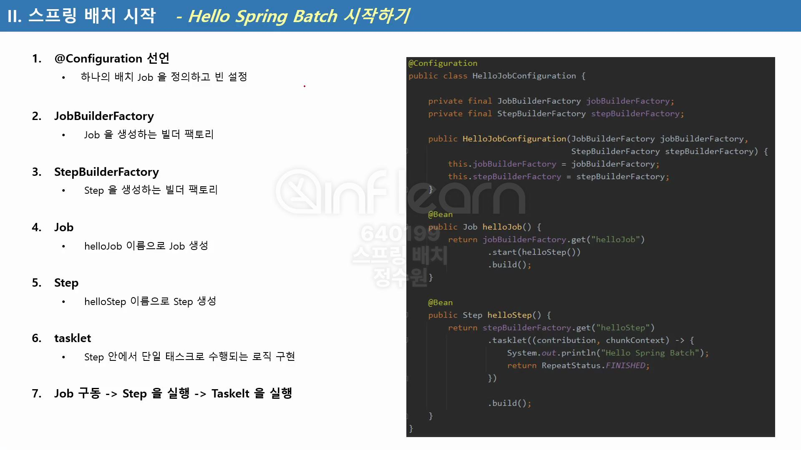

하나의 step 안에서 tasklet이 포함되고 그리고 step이 tasklet을 수행하는 구조이기 때문에, <br>
tasklet은 작업내용을 기술하는 곳이다. <br>

코드로 보자. <br>
```java
@Configuration
@RequiredArgsConstructor
public class HelloJobConfiguration {

    private final JobBuilderFactory jobBuilderFactory;
    private final StepBuilderFactory stepBuilderFactory;

    @Bean
    public Job helloJob() {
        return jobBuilderFactory.get("helloJob")
                .start(helloStep1())
                .next(helloStep2())
                .build();
    }

    @Bean
    public Step helloStep1() {
        return stepBuilderFactory.get("helloStep1")
                .tasklet((stepContribution, chunkContext) -> {
                    //return null
                    //return null을 안한 이유.
                    //기본적으로 tasklet에서는 지금 여기 안의 코드를 무한 반복 시킨다.
                    //그래서 무한 반복이 되면 안되게 하기 위해 RepeatStatus.FINISHED 이걸 넣은 것이다.
                    //null도 기본적으로 한번 실행되고 종료된다. 근데 이거랑 같은게 RepeatStatus.FINISHED이다.

                    System.out.println(" =======================");
                    System.out.println(" >> Hello Spring Batch1!!");
                    System.out.println(" =======================");

                    return RepeatStatus.FINISHED;
                }).build();
    }

    @Bean
    public Step helloStep2() {
        return stepBuilderFactory.get("helloStep2")
                .tasklet((stepContribution, chunkContext) -> {
                    System.out.println(" =======================");
                    System.out.println(" >> Hello Spring Batch2!!");
                    System.out.println(" =======================");

                    return RepeatStatus.FINISHED;
                }).build();
    }

}
```

```
Job: [SimpleJob: [name=helloJob]] launched with the following parameters: [{}]
```
콘솔에서 내가 만든 job을 확인할 수 있다.
