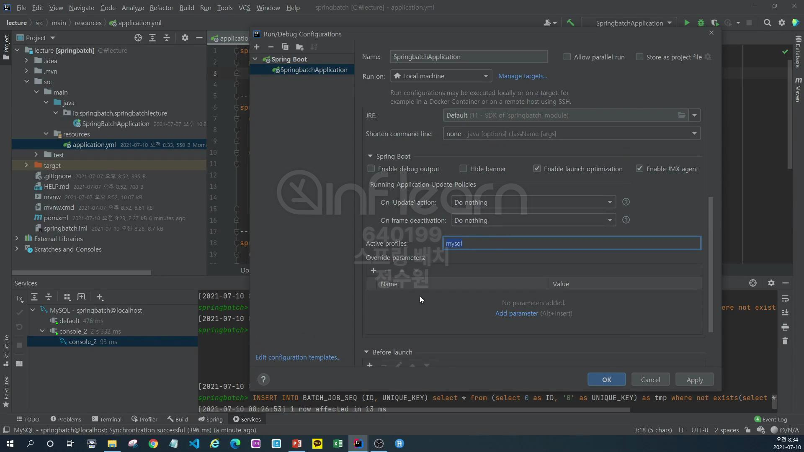
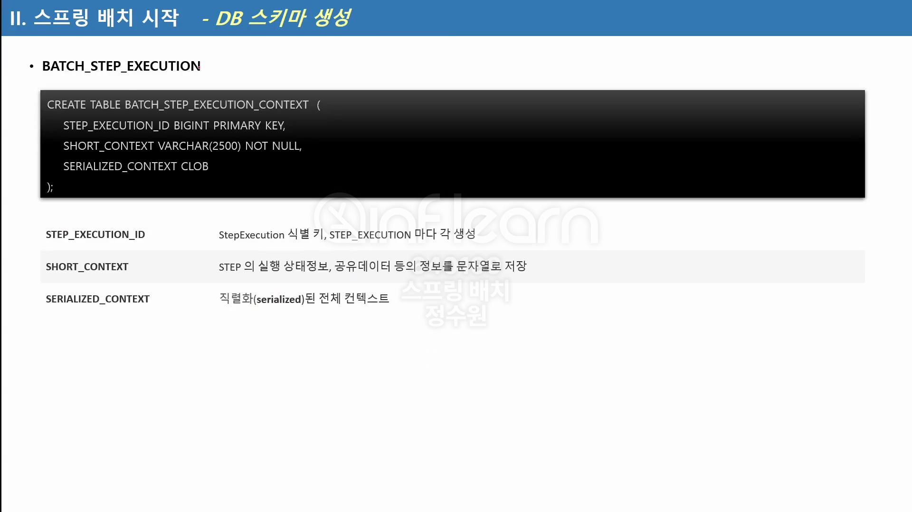

mysql은 docker로 실행시킴
```shell
docker run --name springboot-mysql -e MYSQL_ALLOW_EMPTY_PASSWORD=yes -p 3306:3306 -d mysql
```
<br>

이제 테이블을 생성할건데 테이블을 생성하는것은 2가지 방법이 있다. 수동, 자동 <br>
수동으로 하는 방법은 아래 패키지에<br>


위와 같이 sql들이 있다. <br>

mysql 쿼리를 확인해보자. 
이것 전체를 복사한 다음 

나도 내가 실행한 도커에서 springbatch database를 생성함 <br>
```sql
create database springbatch;
use springbatch;
```

쿼리 복붙해서 실행!

총 9개의 테이블이 생성! 
이것이 수동으로 테이블을 생성하는 방법이다. <br>
이번엔 자동으로 생성하는 것을 해보자. <br>

mysql 의존성 추가 <br>
자동 실행을 위해선 application.yml을 수정해야한다. <br>
그런데 앞으로 job을 실행시킬 때 h2, mysql등 원하는 database를 선택할 수 있도록 설정을 추가할 것이다. -> profile <br>
그래서 그렇게 하려면, spring에서 제공하는 profile을 사용하자. <br>
profile 2개를 만드자. local, mysql <br>
application.yml
```yml
spring:
  profiles:
    active: local

---
spring:
  config:
    activate:
      on-profile: local
  datasource:
    hikari:
      jdbc-url: jdbc:h2:mem:testdb;DB_CLOSE_DELAY=-1;DB_CLOSE_ON_EXIT=FALSE
      username: sa
      password:
      driver-class-name: org.h2.Driver

---
spring:
  config:
    activate:
      on-profile: mysql
  datasource:
    hikari:
      jdbc-url: jdbc:mysql://localhost:3306/springbatch?useUnicode=true&characterEncoding=utf8
      username: root
      password:
      driver-class-name: com.mysql.jdbc.Driver
```
자동으로 한번 해보자. 이미 생성된 database는 drop시키자. <br>

자동 생성을 위해 설정을 해보자. <br>
아래처럼 yml을 수정해주자. <br>
```yml
spring:
  profiles:
    active: local

---
spring:
  config:
    activate:
      on-profile: local
  datasource:
    hikari:
      jdbc-url: jdbc:h2:mem:testdb;DB_CLOSE_DELAY=-1;DB_CLOSE_ON_EXIT=FALSE
      username: sa
      password:
      driver-class-name: org.h2.Driver

---
spring:
  config:
    activate:
      on-profile: mysql
  datasource:
    hikari:
      jdbc-url: jdbc:mysql://localhost:3306/springbatch?useUnicode=true&characterEncoding=utf8
      username: root
      password:
      driver-class-name: com.mysql.jdbc.Driver
  # 이부분 추가
  batch:
    jdbc:
      initialize-schema: always
```
이제 mysql profile을 사용해야 하는데 위의
```yml
spring:
  profiles:
    active: mysql
```
이렇게 실행시켜도 돼고 

이렇게 mysql을 줘도 된다. 이게 우선순위가 높아서 mysql이 적용된다. 

다시 테이블이 생성된것을 확인할 수 있다. <br>
그래서 개발 테스트를 할 땐 이렇게 
```yml
  # 이부분 추가
  batch:
    jdbc:
      initialize-schema: always
```
주고 하면 된다. 
근데 never로 변경한 상태에서 아래처럼
```yml
batch:
    jdbc:
      initialize-schema: never
```
이렇게 실행을 했을 때 아래처럼 table을 날리고 <br>

실행을 하면 오류가 난다. 이걸 테스트해보려면 간단하게라도 job이 구성이 되있어야 한다. <br>
그 job이 실행중에 table에 meta data를 저장할 것인데 그때, table이 없을경우에 오류를 내뱉을 것이다. <br>

```java
@Configuration
@RequiredArgsConstructor
public class DBJobConfiguration {
    private final JobBuilderFactory jobBuilderFactory;
    private final StepBuilderFactory stepBuilderFactory;
    
    @Bean
    public Job job() {
        return jobBuilderFactory.get("job")
                .start(step1())
                .next(step2())
                .build();
    }

    private Step step1() {
        return stepBuilderFactory.get("step1")
                .tasklet((stepContribution, chunkContext) -> {
                    System.out.println("step1 was executed");
                    return RepeatStatus.FINISHED;
                }).build();
    }

    private Step step2() {
        return stepBuilderFactory.get("step2")
                .tasklet((stepContribution, chunkContext) -> {
                    System.out.println("step2 was executed");
                    return RepeatStatus.FINISHED;
                }).build();
    }
}
```

이렇게 job을 실행시키고 배치를 시작하면 오류가 난다. <br>
자동 실행해서 테이블을 생성하지도 않고 수동으로 테이블을 생성하지도 않은 상태이기 때문에 spring batch는 메타데이터를 저장할 때 테이블을 <br>
찾지못해 에러가 난다.


springbatch.BATCH_JOB_INSTANCE를 찾지 못한다는 오류가 발생!
<br>
근데 h2, 즉 메모리 db가 기본이 될 때는 생성이 되지 않아도 된다. <br>

이렇게 수정하고

로컬로 실행시키면 에러가 안난다.
<br>




테스트를 해보자. <br>

always로 고치고 mysql로 실행시키면 SEQ를 제외하고 6개의 테이블이 생성되었다. <br>

BATCH_JOB_INSTANCE 테이블을 보면 id가 들어가있다. 버전과 JOB_NAME이 보인다. 저 JOB_NAME은<br>

여기서 지정한 값이다. JOB_KEY는 JOB_NAME하고 JOB_PARAMETER의 값이 합쳐져서 HASH값으로 들어간다. <br>

BATCH_JOB_EXECUTION은 job이 실행되는 동안의 job과 관련된 실행정보가 저장된다.

PARAMS는 전달한 값이 없기 때문에 비어있다. 


