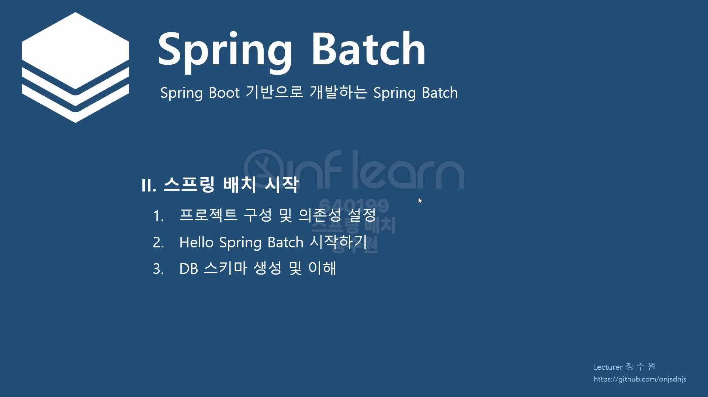

@EnableBatchProcessing이 실제로 작동이 되면 -> SimpleBatchConfiguration이 초기화 하는 class가 호출이 되고  
그 다음에 이 클래스 다음으로는 BasicBatchConfigurer, JpaBasicConfigurer의 설정 클래스가 다시 동작을 하고 마지막으로  
BatchAutoConfiguration이 동작을 하게 된다.  

 

코드로 확인해보자.  

디버깅 모드로 실행을 하게 되면 가장 먼저 아래로 온다.  

SimpleBatchConfiguration 클래스를 쭉 보면  

Spring Batch에 중요한 클래스들의 bean들을 생성하고 있다.  
그런데 빈들을 생성할 때 모두 createLazyProxy로 Proxy 객체로 생성을 하고 있다.  
그렇기 때문에 실제 생성되는 객체는 proxy 객체고 실제 객체는 아니다.  

프록시 객체 확인!
그리고 이 작업이 끝나게 되면  

BatchConfigurerConfiguration 클래스가 작동을 하게 된다.  
여기에는 2가지가 있다. 하나는 BasicBatchConfigurer이고 또 하나는 JpaBatchConfigurer이다.   

근데 JpaBatchConfigurer는 BasicBatchConfigurer를 상속받고 있다. 그래서 data들이 서로 공유가 되는것이다.  
그래서 이 클래스들이 생성이 되고 설정이진행이된다. 그리고 마지막으로  

이 설정 클래스가 동작을 하게 된다.  
 

