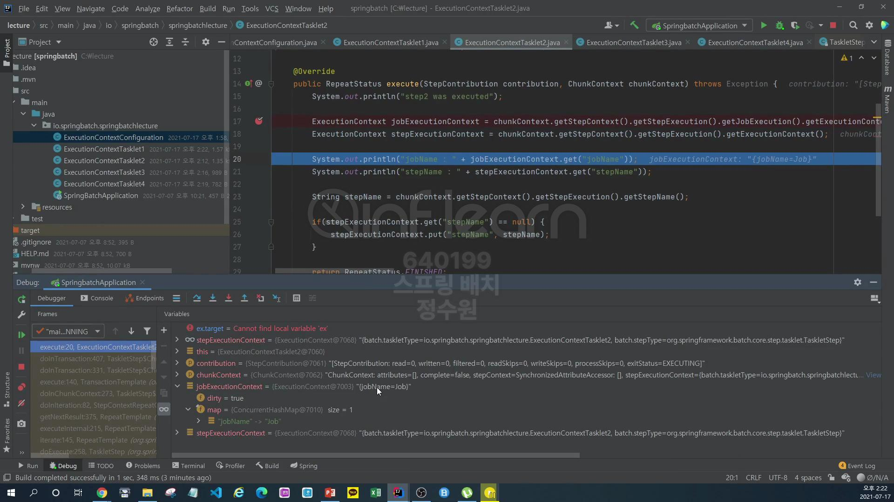
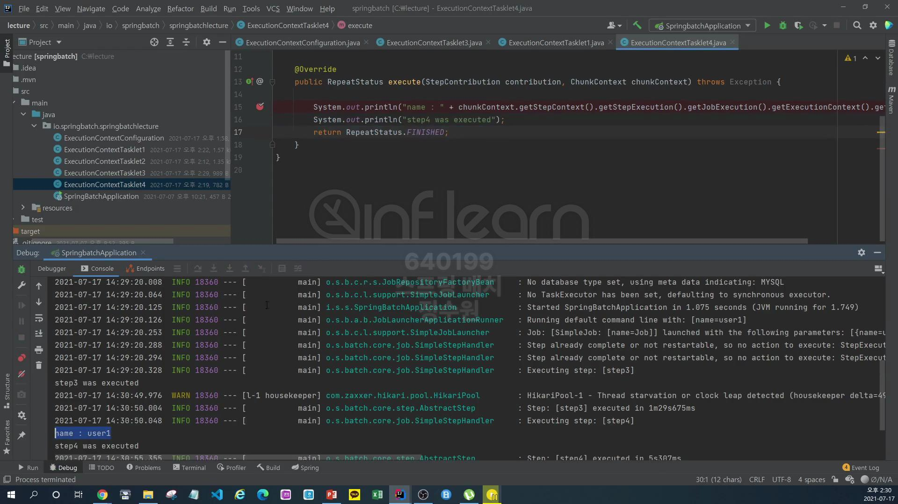

```java
@Configuration
@RequiredArgsConstructor
public class ExecutionContextConfiguration {
    private final JobBuilderFactory jobBuilderFactory;
    private final StepBuilderFactory stepBuilderFactory;

    @Bean
    public Job BatchJob() {
        return this.jobBuilderFactory.get("Job")
                .start(step1())
                .next(step2())
                .next(step3())
                .next(step4())
                .build();
    }

    public Step step1() {
        return stepBuilderFactory.get("step1")
                .tasklet(null)
                .build();
    }

    public Step step2() {
        return stepBuilderFactory.get("step2")
                .tasklet(null)
                .build();
    }

    public Step step3() {
        return stepBuilderFactory.get("step3")
                .tasklet(null)
                .build();
    }

    public Step step4() {
        return stepBuilderFactory.get("step4")
                .tasklet(null)
                .build();
    }
}
```
지금은 tasklet을 null로 했지만, 만들어서 설정해보자. <br>
먼저 각각의 tasklet을 만들어서 그 tasklet의 인자로 주어지는 stepConfiguration 또는 ChunkContext를 통해 StepExecution을 뽑아내고 그리고 <br>
StepExecution에 포함된 ExecutionContext와 그리고 StepExecution에서 jobExecution을 참조할 수 있어서 그래서 JobExecution에서 ExecutionContext <br>
객체들을 꺼내와서 Step 간에 어떻게 공유를 해서 데이터를 어떻게 주고 받을 수 있는지에 대한 사용 방법과 그 다음에 task 별로 생성된 ExecutionContext가 <br>
Database에 어떻게 저장이 되어지고 하는 등등의 테스트를 해보겠다. <br>
총 4개의 tasklet을 생성해보자. <br>
```java
@Component
public class ExecutionContextTasklet1 implements Tasklet {

    @Override
    public RepeatStatus execute(StepContribution stepContribution, ChunkContext chunkContext) throws Exception {
        System.out.println("step1 was executed");
        return RepeatStatus.FINISHED;
    }

}
```
```java
@Component
public class ExecutionContextTasklet2 implements Tasklet {

    @Override
    public RepeatStatus execute(StepContribution stepContribution, ChunkContext chunkContext) throws Exception {
        System.out.println("step2 was executed");
        return RepeatStatus.FINISHED;
    }

}
```
```java
@Component
public class ExecutionContextTasklet3 implements Tasklet {

    @Override
    public RepeatStatus execute(StepContribution stepContribution, ChunkContext chunkContext) throws Exception {
        System.out.println("step3 was executed");
        return RepeatStatus.FINISHED;
    }

}
```
```java
@Component
public class ExecutionContextTasklet4 implements Tasklet {

    @Override
    public RepeatStatus execute(StepContribution stepContribution, ChunkContext chunkContext) throws Exception {
        System.out.println("step4 was executed");
        return RepeatStatus.FINISHED;
    }
    
}
```
실행을 시켜보자. <br>

성공적으로 실행이 되었다. <br>

이번에는 stepExecution에서 executionContext를 꺼내보고, stepExecution에 있는 jobExecution을 꺼내서 jobExecution에 있는 executionContext도 꺼내보자. <br>
```java
@Component
public class ExecutionContextTasklet1 implements Tasklet {

    @Override
    public RepeatStatus execute(StepContribution stepContribution, ChunkContext chunkContext) throws Exception {
        System.out.println("step1 was executed");

        ExecutionContext jobExecutionContext = stepContribution.getStepExecution().getJobExecution().getExecutionContext();
        ExecutionContext stepExecutionContext = stepContribution.getStepExecution().getExecutionContext();

        


        return RepeatStatus.FINISHED;
    }

}
```
jobExecutionContext에는 jobName을 저장하고, stepExecutionContext에는 stepName을 저장해보자. <br>
```java
@Component
public class ExecutionContextTasklet1 implements Tasklet {

    @Override
    public RepeatStatus execute(StepContribution stepContribution, ChunkContext chunkContext) throws Exception {
        System.out.println("step1 was executed");

        ExecutionContext jobExecutionContext = stepContribution.getStepExecution().getJobExecution().getExecutionContext();
        ExecutionContext stepExecutionContext = stepContribution.getStepExecution().getExecutionContext();

        String jobName = chunkContext.getStepContext().getStepExecution().getJobExecution().getJobInstance().getJobName();
        String stepName = chunkContext.getStepContext().getStepExecution().getStepName();

        return RepeatStatus.FINISHED;
    }

}
```
jobName은 jobExecutionContext에 저장하고, stepName은 stepExecutionContext에 저장해보자. <br>
그리고 이 저장된 값들이 그 다음 step에서 어떻게 공유가 되는지 확인해보자. <br>
```java
@Component
public class ExecutionContextTasklet1 implements Tasklet {

    @Override
    public RepeatStatus execute(StepContribution stepContribution, ChunkContext chunkContext) throws Exception {
        System.out.println("step1 was executed");

        ExecutionContext jobExecutionContext = stepContribution.getStepExecution().getJobExecution().getExecutionContext();
        ExecutionContext stepExecutionContext = stepContribution.getStepExecution().getExecutionContext();

        String jobName = chunkContext.getStepContext().getStepExecution().getJobExecution().getJobInstance().getJobName();
        String stepName = chunkContext.getStepContext().getStepExecution().getStepName();

        if (jobExecutionContext.get("jobName") == null) {
            jobExecutionContext.put("jobName", jobName);
        }

        if (stepExecutionContext.get("stepName") == null) {
            stepExecutionContext.put("stepName", stepName);
        }

        System.out.println("jobName = " + jobExecutionContext.get("jobName"));
        System.out.println("stepName = " + stepExecutionContext.get("stepName"));

        return RepeatStatus.FINISHED;
    }

}
```
자 일단 이렇게 구성을 하고 두번째 tasklet에서 한번 꺼내보자. <br>
```java
@Component
public class ExecutionContextTasklet2 implements Tasklet {

    @Override
    public RepeatStatus execute(StepContribution stepContribution, ChunkContext chunkContext) throws Exception {
        System.out.println("step2 was executed");

        ExecutionContext jobExecutionContext = chunkContext.getStepContext()
                .getStepExecution().getJobExecution().getExecutionContext();
        ExecutionContext stepExecutionContext = chunkContext.getStepContext().getStepExecution().getExecutionContext();

        System.out.println("jobName = " + jobExecutionContext.get("jobName"));
        System.out.println("stepName = " + jobExecutionContext.get("stepName"));

        String stepName = chunkContext.getStepContext().getStepExecution().getStepName();
        if (stepExecutionContext.get("stepName") == null) {
            stepExecutionContext.put("stepName", stepName);
        }

        return RepeatStatus.FINISHED;
    }

}
```
이 코드의 의미는 step1에서 이미 jobExecutionContext와 stepExecutionContext이 클래스들 안에 jobName과 stepName을 저장하는 구문을 담았다. <br>
그러면 이 data들이 이미 만약 정상적으로 step1이 종료가 되었다면, 그 db에 내용들이 들어가 있을것이고 step2를 실행하는 시점에는 jobExecution의 내용들이 <br>
이곳으로 전달되어서 공유가 가능할 것이고 그러나 stepExecution에 있는 데이터들은 step간에 공유가 되지 않기 때문에 보이지 않을 것이다. <br>
<br>
그리고 step3에서는 예외를 발생시킬 것이다. <br>
step4는 예외때문에 넘어오지 않을것이다. 그렇게 되면 Job의 전체적인 상태가 실패가 됐기 때문에 재시작 할 수 있다. 그러면 Job을 재시작했을 경우에 우리가 이미 <br>
실패한 그 지점에 데이터를 다시 가져올 수 있는지? 그리고 가지고와서 실패한 그 데이터를 재시작했을 경우애는 이제 성공적으로 그 단계가 이루어진다고 했을 때 실패한 그<br>
데이터를 활용할 수 있는지 해보자. <br>
```java
@Component
public class ExecutionContextTasklet3 implements Tasklet {

    @Override
    public RepeatStatus execute(StepContribution stepContribution, ChunkContext chunkContext) throws Exception {
        System.out.println("step3 was executed");

        Object name = chunkContext.getStepContext().getStepExecution().getJobExecution().getExecutionContext().get("name");

        if (name == null) {
            chunkContext.getStepContext().getStepExecution()
                    .getJobExecution().getExecutionContext().put("name", "user1");

            throw new RuntimeException("step3 was failed");
        }
        
        return RepeatStatus.FINISHED;
    }
}

```
```java
@Component
public class ExecutionContextTasklet4 implements Tasklet {

    @Override
    public RepeatStatus execute(StepContribution stepContribution, ChunkContext chunkContext) throws Exception {
        System.out.println("name : " +
                chunkContext.getStepContext().getStepExecution().getJobExecution().getExecutionContext().get("name")
        );
        
        System.out.println("step4 was executed");
        return RepeatStatus.FINISHED;
    }
}
```
실행을 시켜보자. <br>


jobExecutionContext와 stepExecutionContext를 뽑아 냈다. <br>

현재 jobExecutionContext는 아직 아무런 내용이 없다. <br>

stepExecutionContext에는 우리가 저장한 내용은 없지만, 스프링 배치가 내부적으로 생성하는 taskletType 그러니까 우리가 만든 Class type을 저장했고 <br>
stepType이라고 해서 이 tasklet을 실행하는 step의 구현체를 저장해준다. <br>
이제 <br>

jobName, stepName을 가지고 온다. <br>

콘솔애 찍힌것 확인! 근데 console에 stepName이 null이라고 나오는데 이건 인강에서 오류낸것! 
```java
System.out.println("jobName = " + jobExecutionContext.get("jobName"));
System.out.println("stepName = " + stepExecutionContext.get("stepName"));
```
이렇게 해야하는데 
```java
System.out.println("jobName = " + jobExecutionContext.get("jobName"));
System.out.println("stepName = " + jobExecutionContext.get("stepName"));
```
이렇게 했음.
<br>
여기까지 하고 db를 확인해보면 <br>

아직까진 HashMap을 사용한다는 정도만 저장 돼 있고 <br>

여기도 우리가 저장한 내용은 없다. <br>
그럼 두번째 step으로 가면 <br>

jobExecutionContext에는 앞서 저장한 jobName이 저장 돼 있는것을 확인할 수 있다. <br>
 
jobExecution이기 때문에 step 간에 공유할 수 있도록 그 데이터가 참조 되고 있고 <br> 

stepExecutionContext에는 앞서 저장한 stepName이 보이지 않는다. <br>
왜냐? 현재 step은 step2이다 근데 앞에서 저장한 stepName은 step1에 있는 executionContext에 저장이 되어 있기 때문에 step2에서는 그 내용을 <br>
공유받을 수 없는 것이다. <br>

그래서 다시 현재 name인 step2를 저장해준다. <br>
이제 step3에서 에러가 발생하고 step4는 실행되지 않는다. <br>
이제 디버깅이 끝나고 db를 확인해보자. <br>

JOB_INSTANCE가 하나 생겼다. 

JOB_EXECUTION이 하나 생겼다. 그런데 상태값이 FAILED로 되어 있다. <br>

step이 하나라도 실패하면 FAIL <br>

name user1이 들어가 있는데 이건 program argument로 넣은 것이다. <br>


3개만 저장 돼 있다. <Br>

이제 재시작 해보자. step3를 정상동작하게 하고! <br>
```java
@Component
public class ExecutionContextTasklet3 implements Tasklet {

    @Override
    public RepeatStatus execute(StepContribution stepContribution, ChunkContext chunkContext) throws Exception {
        System.out.println("step3 was executed");

        Object name = chunkContext.getStepContext().getStepExecution().getJobExecution().getExecutionContext().get("name");

        if (name == null) {
            chunkContext.getStepContext().getStepExecution()
                    .getJobExecution().getExecutionContext().put("name", "user1");
        }

        return RepeatStatus.FINISHED;
    }
}
```
```
chunkContext.getStepContext().getStepExecution().getJobExecution().getExecutionContext().get("name");
```
이 값을 제대로 가져 올까?

여기의 SHORT_CONTEXT에서 값을 가져와야 할것이다. <br>


그리고 각 step마다 우리가 저장한것처럼 stepName : step1 등의 값을 사용한느지. <br>
그런데 우리가 지금 재시작을 시키면 step1, step2는 이미 실행이 된 상태이기 때문에 step3부터 시작이 될 것이다. <br>
```java
@Component
public class ExecutionContextTasklet3 implements Tasklet {

    @Override
    public RepeatStatus execute(StepContribution stepContribution, ChunkContext chunkContext) throws Exception {
        System.out.println("step3 was executed");

        Object name = chunkContext.getStepContext().getStepExecution().getJobExecution().getExecutionContext().get("name");

        if (name == null) {
            chunkContext.getStepContext().getStepExecution()
                    .getJobExecution().getExecutionContext().put("name", "user1");
            throw new RuntimeException("step3 was failed");
        }

        return RepeatStatus.FINISHED;
    }
}
```
재시작을 하면 name이 0이 아닐것이다. <br> 

step1과 step2를 뛰어넘고 바로 옴.

그리고 값이 이미 db에 저장됐기 때문에 name 값도 가지고 온다. <br>

그래서 성공!


job이 완료 된다.<br>

한번 더 실행이 됐기 때문에 JOB_EXECUTION이 하나 더 추가 됐다. 

step3, step4가 추가. <br>


