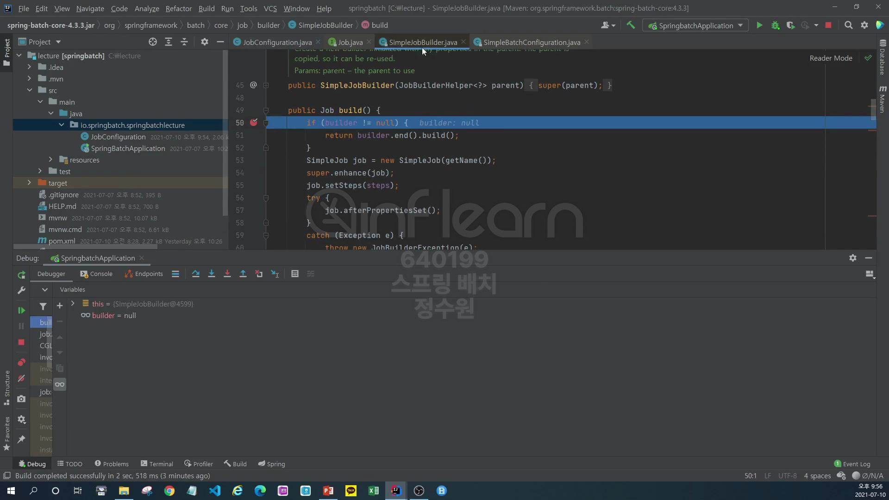
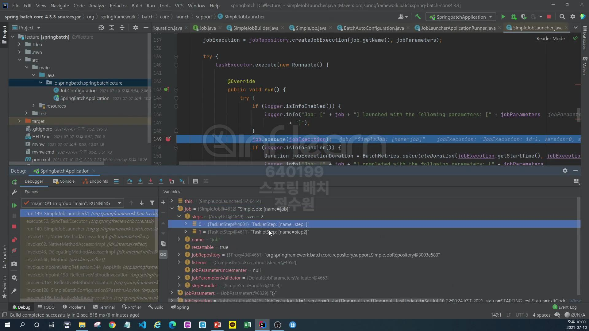
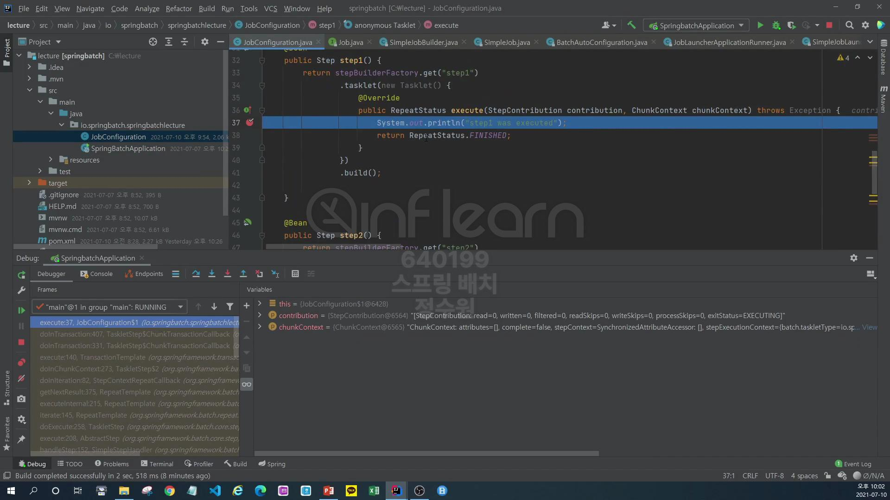
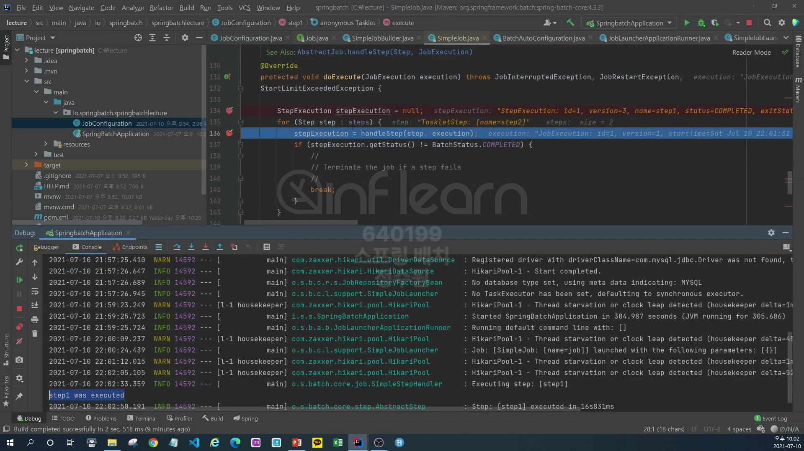

그럼 이제 간단하게 job을 구성해보고 스프링 배치의 잡을 실행시켰을 때, 실제로 job의 스탭들이 구성이 돼고 이런 step들을 <br>
field들이
<br>
어떻게 실행을 하는지의 내부 구조들 그러니까 흐름들을 하나하나 짚어가는 과정을 해보자. 

```java
@Configuration
@RequiredArgsConstructor
public class JobConfiguration {
    private final JobBuilderFactory jobBuilderFactory;
    private final StepBuilderFactory stepBuilderFactory;

    @Bean
    public Job job() {
        return jobBuilderFactory.get("job")
                .start(step1())
                .next(step2())
                .build();
    }

    @Bean
    public Step step1() {
        return stepBuilderFactory.get("step1")
                .tasklet((stepContribution, chunkContext) -> {
                    System.out.println("step1 was executed");
                    return RepeatStatus.FINISHED;
                })
                .build();
    }

    @Bean
    public Step step2() {
        return stepBuilderFactory.get("step2")
                .tasklet((stepContribution, chunkContext) -> {
                    System.out.println("step2 was executed");
                    return RepeatStatus.FINISHED;
                })
                .build();
    }
}
```
코드를 작성하고 breakpoint을 통해 debug해보자.

mysql로 실행
<br>

bean을 만드는것은 singleton으로 만드는 과정이다. <br>

여기 보면 start(Step step)으로 paramater를 받는다. 위에 보면 

List<Step> steps = new ArrayList<>(); 변수가 보인다. <br>

그리고 steps에는 하나의 step이 들어가고 그 구현체는 TaskletStep이다. <br>

그리고 두번째 스탭을 넣는다. <br>
그러면 최종적으로 steps에는 두개의 step이 있게된다. <br>

그리고 build를 하게 된다. 이 build를 하게 되면 실제로 job 객체를 만들게된다. <br>

이 job은 interface이다. 

그리고 그 구현체는 크게 2개인데 하나는 SimpleJob과 FlowJob이다. <br>

지금은 SimpleJob으로 들어가게 되고 이걸 build하면 new SimpleJob이 호출된다. <br>

아까 만든 2개의 step을 담는 steps를 넣는다. <br>
그말은 job이 2개의 step을 포함한다는 의미이다. <br>

이렇게 설정이 끝난다.
<br>
그럼 이제 실행을 해야하는데 springboot는 자동으로 실행을 시켜준다. 

그게 여기다. JobLauncherApplicationRunner가 실행을 시킨다. <br>

this.jobLauncher.run(job, parameter); <br>
2개의 인자를 받고 run하고 있다. <br>


job.execute(jobExecution);에 breakpoint를 잡는다. 이 job은 지금 SimpleJob이다.  <br>

SimpleJob은 두개의 Step을 가지고 있고 

step은 여러개의 값들을 가지고 있는데 

여기서 tasklet은 우리가 구성한 tasklet이다. <br>


execute하면 드디어 SimpleJob으로 왔다. 그런데 지금은 Simplejob의 부모인 AbstractJob이고 여기서 여러가지 작업을 한다음 <br>

doExecute를 호출한다. <br>

SimpleJob으로 온다. <br>

for 구문을 돌면서 반복하면서 step들을 실행시킨다. <br>

그리고 실제로 SimpleJob은 StepHandler라는 클래스를 통해서 Step을 실행시킨다. <br>

이렇게 해서 step이 실행됐고 

로그가 찍혔고 

두번째 스탭이 실행된다


그리고 이제 종료.


