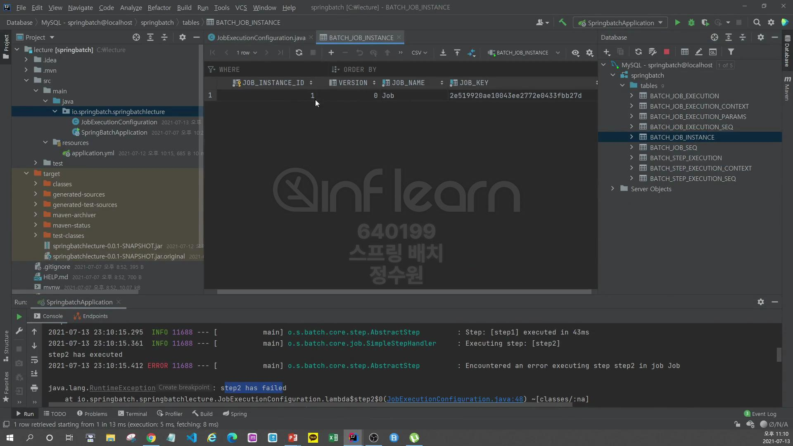

test 해보자 <br>
```java
@RequiredArgsConstructor
@Configuration
public class JobExecutionConfiguration {
    private final JobBuilderFactory jobBuilderFactory;
    private final StepBuilderFactory stepBuilderFactory;

    @Bean
    public Job BatchJob() {
        return this.jobBuilderFactory.get("job")
                .start(step1())
                .next(step2())
                .build();
    }

    @Bean
    public Step step1() {
        return stepBuilderFactory.get("step1")
                .tasklet((contribution, chunkContext) -> {
                    System.out.println("Step 1 executed");
                    return RepeatStatus.FINISHED;
                })
                .build();
    }

    @Bean
    public Step step2() {
        return stepBuilderFactory.get("step2")
                .tasklet((contribution, chunkContext) -> {
                    System.out.println("Step 2 executed");
                    return RepeatStatus.FINISHED;
                })
                .build();
    }
}

```

 program arguments에 이렇게 값을 주면 jobParameter에 저장이 된다.

정상적으로 실행 됐다. <br>

job의 status가 completed됐다. <br>

instance의 값이 정상적으로 저장 됐다. 

execution을 보면 job_instance_id가 1로 되어있다. 부모 id가 1이라는 의미 <br>

그리고 status가 completed로 되어있다. <br>
BATCH_JOB_INSTANCE와 BATCH_JOB_EXECUTION은 실행을 시켰을 때 하나씩만 저장된다. (성공적으로(COMPLETED)로 끝날 경우에는) <br>

그런데 재실행을 하게 되면 오류가 난다.
<br>

테이블의 내용을 초기화 하고 
```java
@RequiredArgsConstructor
@Configuration
public class JobExecutionConfiguration {
    private final JobBuilderFactory jobBuilderFactory;
    private final StepBuilderFactory stepBuilderFactory;

    @Bean
    public Job BatchJob() {
        return this.jobBuilderFactory.get("job")
                .start(step1())
                .next(step2())
                .build();
    }

    @Bean
    public Step step1() {
        return stepBuilderFactory.get("step1")
                .tasklet((contribution, chunkContext) -> {
                    System.out.println("Step 1 executed");
                    return RepeatStatus.FINISHED;
                })
                .build();
    }

    @Bean
    public Step step2() {
        return stepBuilderFactory.get("step2")
                .tasklet((contribution, chunkContext) -> {
                    System.out.println("Step 2 executed");

                    throw new RuntimeException("step2 has failed");

//                    return RepeatStatus.FINISHED;
                })
                .build();
    } 
}

```
step2에서 예외를 발생 시켰다. <br>
실행을 하면 

예외가 발생한다.

여기는 변화가 없이 하나가 생성된다. <br>


상태 값이 FAILED로 되어있다. <br>
그럼 이상태에서 또 실행을 해보자. <br>
아까는 이미 저장된 job_instance라고 오류가 발생하는데 지금은! <br>

그 오류가 발생하지 않는다. 

```java
@RequiredArgsConstructor
@Configuration
public class JobExecutionConfiguration {
    private final JobBuilderFactory jobBuilderFactory;
    private final StepBuilderFactory stepBuilderFactory;

    @Bean
    public Job BatchJob() {
        return this.jobBuilderFactory.get("job")
                .start(step1())
                .next(step2())
                .build();
    }

    @Bean
    public Step step1() {
        return stepBuilderFactory.get("step1")
                .tasklet((contribution, chunkContext) -> {
                    System.out.println("Step 1 executed");
                    return RepeatStatus.FINISHED;
                })
                .build();
    }

    @Bean
    public Step step2() {
        return stepBuilderFactory.get("step2")
                .tasklet((contribution, chunkContext) -> {
                    System.out.println("Step 2 executed");
                    return RepeatStatus.FINISHED;
                })
                .build();
    }
}
```
이번엔 예외를 발생시키지 않고 성공시켜 보자. <br>

job instance는 하나가 생성되고 성공하게 된다.<br>
execution에서 보면 <br>

job_instance_id가 1로 되어있고(1:n). <br>

COMPLETED로 되어있다. <br>


