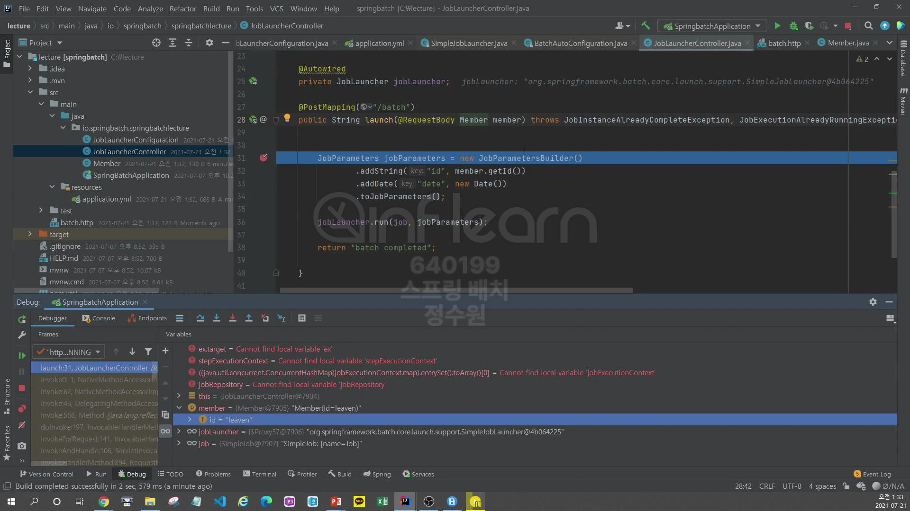
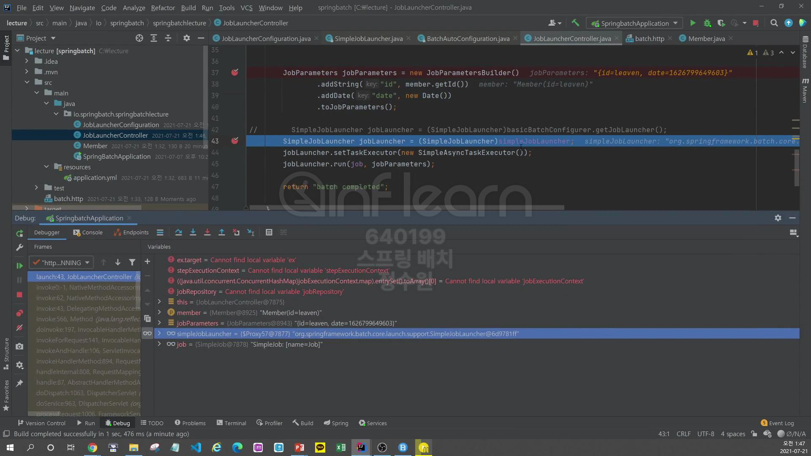

 
 
 
 ```java
@Configuration
@RequiredArgsConstructor
public class JobLauncherConfiguration {
    private final JobBuilderFactory jobBuilderFactory;
    private final StepBuilderFactory stepBuilderFactory;


    @Bean
    public Job BatchJob() {
        return this.jobBuilderFactory.get("Job")
                .start(step1())
                .next(step2())
                .build();
    }

    @Bean
    public Step step1() {
        return stepBuilderFactory.get("step1")
                .tasklet((contribution, chunkContext) -> RepeatStatus.FINISHED)
                .build();
    }

    @Bean
    public Step step2() {
        return stepBuilderFactory.get("step2")
                .tasklet((contribution, chunkContext) -> null)
                .build();
    }
}
```
test를 해보자. 2가지 테스트를 해볼건데.
1. SpringBoot가 위에 설정한 배치를 실행시키는 과정
2. JobLauncher를 통한 동기적 실행과 비동기적 실행을 볼것이다. <br>

첫번째를 먼저 보자. <br>

이 클래스에서 JobLauncherApplicationRunner를 초기화한다. <Br>

이 클래스는 ApplicationRunner interface를 구현하고 있다. <br>

이 인터페이스는 SpringBoot에서 제공하는 interface로 이 interface는 spring boot가 초기화가 완료되면 이 인터페이스의 run 메서드를 실행시키는 역할을 <br>
한다. 

JobLauncherApplicationRunner는 ApplicationRunner를 구현하고 있기 때문에 run method가 호출된다. <br>
run에서 중간 단계들을 거쳐서 최종적으로는 <br>

아래의 execute 메서드가 호출된다. <br>

JobLauncherApplicationRunner는 jobLauncher, jobExplorer, jobRepository를 가지고 있다. <br>

이렇게 jobLauncher로 run을 하게 된다면, job과 parameters인자를 가지고 실행하게 된다. <Br>

이건 우리가 구성한 job의 구현체 들이다. <Br>
<Br>
이번엔 동기적 실행과 비동기적 실행을 알아보자. <br>
먼저 동기적 실행에 대해서 알아보자. 그렇게 하기 위해서는 스프링 부트가 자동으로 실행되서는 안된다. <br>
동기적, 비동기적 실행을 위새서는 jobLauncher에 taskExecutor를 설정해줘야 한다. <br>
따라서 수동으로 jobLauncher를 설정해야한다. <Br>
Controller를 만들어서 테스트를 해볼것인데, 동기적 방싱과 비동기적 방식의 차이점을 비교해야 하기 때문에 web에서 client가 jobLauncher를 수행하게끔 해서 <Br>
비동기적으로 수행이 되게 해보자. <br>
먼저 web과 관련된 의존성을 추가해보자. <Br>

```java
@RestController
@RequiredArgsConstructor
public class JobLauncherController {

    @Autowired
    private final Job job;

    @Autowired
    private final JobLauncher jobLauncher;

    @PostMapping("/batch")
    public String launch(@RequestBody Member member) throws JobInstanceAlreadyCompleteException, JobExecutionAlreadyRunningException, JobParametersInvalidException, JobRestartException {
        JobParameters jobParameters = new JobParametersBuilder()
                .addString("id", member.getId())
                .addDate("date", new Date())
                .toJobParameters();

        jobLauncher.run(job, jobParameters);

        return "batch completed";
    }
}
```

서버를 구동하고 테스트를 해보자. <br>



성공적으로 완료된다. <br>
이 방식이 동기적 방식이다. 그러나 비동기적으로 실행할 때는 설정을 추가해야한다. <Br>
비동기적 방식은 <br>
이곳에서 

setTaskExecutor를 설정해줘야 한다. <br>
이 값은 

기본적으로는 

SyncTaskExecutor가 설정되어 있다. <br>
그러니까 동기적 방식이다. <br>
여기다 비동기적 방식을 선택해주면 된다. <br>
그렇게 하기 위해서는 현재 이 JobLauncher는 Interfaced이다. 그래서 setTaskExecutor를 설정할 수 없다. <br>
그래서 SimpleJobLauncher를 DI 받아야 하는데 이 SimpleJobLaucher는 Bean으로 생성되지 않는다. <br>
그러니까 jobLauncher 타입으로는 생성되지만 SimpleJobLauncher 타입으로는 생성되지 않는다. <br>
그래서 BasicBatchConfigurer class를 활용해야한다. <Br>
```java
@RestController
@RequiredArgsConstructor
public class JobLauncherController {

    @Autowired
    private final Job job;
    
    @Autowired
    BasicBatchConfigurer basicBatchConfigurer;

    @PostMapping("/batch")
    public String launch(@RequestBody Member member) throws JobInstanceAlreadyCompleteException, JobExecutionAlreadyRunningException, JobParametersInvalidException, JobRestartException {
        JobParameters jobParameters = new JobParametersBuilder()
                .addString("id", member.getId())
                .addDate("date", new Date())
                .toJobParameters();

        SimpleJobLauncher jobLauncher = (SimpleJobLauncher) basicBatchConfigurer.getJobLauncher();
        jobLauncher.setTaskExecutor(new SimpleAsyncTaskExecutor());
        jobLauncher.run(job, jobParameters);

        return "batch completed";
    }
}
```
이렇게 하면 된다. <Br>

근데 아래와 같은 방식으로 실행하면 오류가 난다. <Br>
```java
@RestController
@RequiredArgsConstructor
public class JobLauncherController {

    @Autowired
    private final Job job;

    @Autowired
    private final JobLauncher simpleJobLauncher;

//    @Autowired
//    BasicBatchConfigurer basicBatchConfigurer;

    @PostMapping("/batch")
    public String launch(@RequestBody Member member) throws JobInstanceAlreadyCompleteException, JobExecutionAlreadyRunningException, JobParametersInvalidException, JobRestartException {
        JobParameters jobParameters = new JobParametersBuilder()
                .addString("id", member.getId())
                .addDate("date", new Date())
                .toJobParameters();

//        SimpleJobLauncher jobLauncher = (SimpleJobLauncher) basicBatchConfigurer.getJobLauncher();

        SimpleJobLauncher jobLauncher = (SimpleJobLauncher) simpleJobLauncher;

        jobLauncher.setTaskExecutor(new SimpleAsyncTaskExecutor());
        jobLauncher.run(job, jobParameters);

        return "batch completed";
    }
}

```

예외의 메세지가 typeCasting이 안된다고 에러가 난다. <br>

이유는 jobLauncher가 Proxy로 되어 있기 때문이다. <br>
근데 성공했던 방식은 basicBatchConfigurer이 객체가 proxy의 실제 객체를 가지고 있다.

<br>
동기적 실행은 step1, step2가 실행이 된후 jobExeucution 객체를 반환 받는다. <br>
반면에 비동기적 방식은 바로 jobExecution 객체를 반환 받는다. <br>


