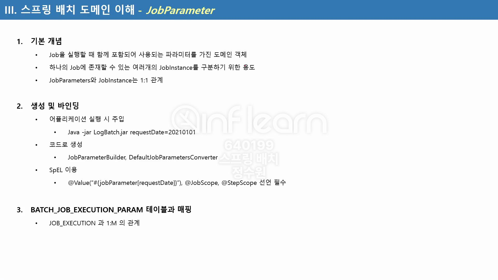
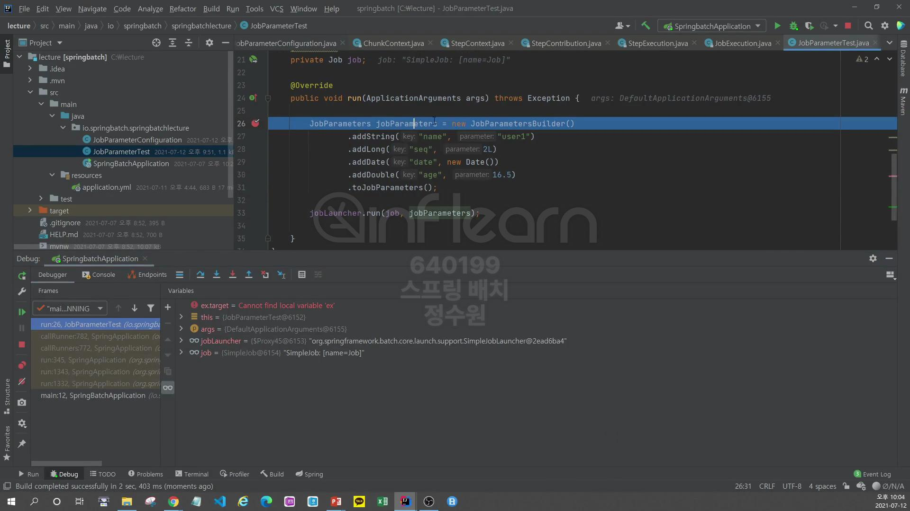

```java
@Configuration
@RequiredArgsConstructor
public class JobParameterConfiguration {
    private final JobBuilderFactory jobBuilderFactory;
    private final StepBuilderFactory stepBuilderFactory;

    @Bean
    public Job BatchJob() {
        return this.jobBuilderFactory.get("Job")
                .start(step1())
                .next(step2())
                .build();
    }

    @Bean
    public Step step1() {
        return stepBuilderFactory.get("step1")
                .tasklet((contribution, chunkContext) -> {
                    System.out.println("Step 1 executed");
                    return RepeatStatus.FINISHED;
                })
                .build();
    }

    @Bean
    public Step step2() {
        return stepBuilderFactory.get("step2")
                .tasklet((contribution, chunkContext) -> {
                    System.out.println("Step 2 executed");
                    return RepeatStatus.FINISHED;
                })
                .build();
    }
}
```
```java
@Component
public class JobParameterTest implements ApplicationRunner {
    @Autowired private JobLauncher jobLauncher;
    @Autowired private Job job;

    @Override
    public void run(ApplicationArguments args) throws Exception {
        JobParameters jobParameters = new JobParametersBuilder()
                .addString("name", "user1")
                .addLong("seq", 2L)
                .addDate("date", new Date())
                .addDouble("age", 16.5)
                .toJobParameters();

        jobLauncher.run(job, jobParameters);
    }
} 
```
실행을 해보고 지정한 parameter들이 table에 잘 들어갔는지 확인해보자. <br>


잘 실행 됐고.


parameter에서 지정한 4개의 값이 지정 돼 있다. <br>

그러면 이번엔 이렇게 저장한 job parameter들의 값을 어디서 어떻게 참조할 수 있는지 살펴보도록 하자. <br>
```java
@Configuration
@RequiredArgsConstructor
public class JobParameterConfiguration {
    private final JobBuilderFactory jobBuilderFactory;
    private final StepBuilderFactory stepBuilderFactory;

    @Bean
    public Job BatchJob() {
        return this.jobBuilderFactory.get("Job")
                .start(step1())
                .next(step2())
                .build();
    }

    @Bean
    public Step step1() {
        return stepBuilderFactory.get("step1")
                .tasklet((contribution, chunkContext) -> {
                    System.out.println("Step 1 executed");
                    return RepeatStatus.FINISHED;
                })
                .build();
    }

    @Bean
    public Step step2() {
        return stepBuilderFactory.get("step2")
                .tasklet((contribution, chunkContext) -> {
                    System.out.println("Step 2 executed");
                    return RepeatStatus.FINISHED;
                })
                .build();
    }
}
```
그건 step 단계에서 참조할 수 있다. <br>

저 step들은 이렇게 쓸 수도 있는데 보면 StepContribution과 ChunkContext가 있다. <br>

먼저 StepContribution을 들어가보면 이 클래스는 StepExecution을 가지고 있다. <br>

그리고 StepExecution은 JobExecution을 가지고 있다. <br>

그리고 JobExecution은 JobParameters를 가지고 있다. <br>

자 이제 jobParameters를 참조할 수 있는데 결국은 StepContribution -> StepExecution -> JobExecution -> JobParameters로 참조할 수 있는것이다. <br>
근데 이제 이건 ChunkContext도 마찬가지여서 ChunkContext를 들어가보면 StepContext가 있고 StepContext는 StepExecution을 가지고 있다. <br>


이제 두개의 클래스에서 어떤 것을 참조해서 사용해도 상관이 없다. 그런데 약간 차이가 있다. 그건 차차 알아보자. <br>
```java
@Configuration
@RequiredArgsConstructor
public class JobParameterConfiguration {
    private final JobBuilderFactory jobBuilderFactory;
    private final StepBuilderFactory stepBuilderFactory;

    @Bean
    public Job BatchJob() {
        return this.jobBuilderFactory.get("Job")
                .start(step1())
                .next(step2())
                .build();
    }

    @Bean
    public Step step1() {
        return stepBuilderFactory.get("step1")
                .tasklet((contribution, chunkContext) -> {
                    JobParameters jobParameters = contribution.getStepExecution().getJobExecution().getJobParameters();

                    //contribution
                    String name = jobParameters.getString("name");
                    Long seq = jobParameters.getLong("seq");
                    Date date = jobParameters.getDate("date");
                    Double age = jobParameters.getDouble("age");

                    System.out.println("name = " + name);
                    System.out.println("seq = " + seq);
                    System.out.println("date = " + date);
                    System.out.println("age = " + age);

                    //chunkContext
                    Map<String, Object> jobParameters1 = chunkContext.getStepContext().getJobParameters();

                    System.out.println("Step 1 executed");
                    return RepeatStatus.FINISHED;
                })
                .build();
    }

    @Bean
    public Step step2() {
        return stepBuilderFactory.get("step2")
                .tasklet((contribution, chunkContext) -> {
                    System.out.println("Step 2 executed");
                    return RepeatStatus.FINISHED;
                })
                .build();
    }
}
```
이렇게 확인할 수 있다. debug로 확인할 수 있다. <br>

여기로 왔다. 여기서 총 4개의 값들을 설정했다. <br>


4개의 값들을 확인할 수 있다. parameters는 LinkedHashMap으로 되어있다. <br>

밑에 값은 이렇다. <br>
일반적으로 batch job을 만들 때는 war가 아닌 jar로 만든다 그리고 그 jar를 실행시킬 때 parameter 값들을 인자로 주게되면 spring batch <br>
가 그 값들을 받아서 우리가 위에 설정한 것처럼 동일한 구성을 해서 job을 실행시킨다. test 해보자. <br>
jar파일을 생성해보자. <br>

우선 clean해서 target 폴더를 비우고 <br>

package를 통해서 target을 다시 만든다. <br>

target에 spring-batch-lecture-0.0.1-SNAPSHOT.jar가 생성된 것을 확인할 수 있다. <br>
이것을 실행시켜 보자. <br>
target으로 이동하고 <br>
```bash
# 타입을 () 안에 표시해 줘야 한다.
java -jar spring-batch-lecture-0.0.1-SNAPSHOT.jar name=user2 seq\(long\)=2L date\(date\)=2021/01/22 age\(double\)=16.5
```

잘 실행이 되었다.
그런데 
```bash
java -jar spring-batch-lecture-0.0.1-SNAPSHOT.jar name=user2 seq=2L date=2021/01/22 age\(double\)=16.5
```
이렇게 타입 지정을 안하고 실행시키면 오류가 난다. 
테스트해보자. 
<br>
```java
//@Component
public class JobParameterTest implements ApplicationRunner {
    @Autowired private JobLauncher jobLauncher;
    @Autowired private Job job;

    @Override
    public void run(ApplicationArguments args) throws Exception {
        JobParameters jobParameters = new JobParametersBuilder()
                .addString("name", "user1")
                .addLong("seq", 2L)
                .addDate("date", new Date())
                .addDouble("age", 16.5)
                .toJobParameters();

        jobLauncher.run(job, jobParameters);
    }
}
```
```yml
      driver-class-name: com.mysql.jdbc.Driver
      batch:
        job:
          enabled: true
        jdbc:
          initialize-schema: always
```
그리고 clean -> package를 통해서 jar파일을 생성하고 <br>
실행시켜보면 

오류가 발생하고 출력이 돠지 않는다. <br>
정상적으로 다시 실행시켜보자. <br>
```bash
java -jar spring-batch-lecture-0.0.1-SNAPSHOT.jar name=user2 seq\(long\)=2L date\(date\)=2021/01/22 age\(double\)=16.5
```


<br>
그리고


이렇게 붙혀넣고 실행시키면 
