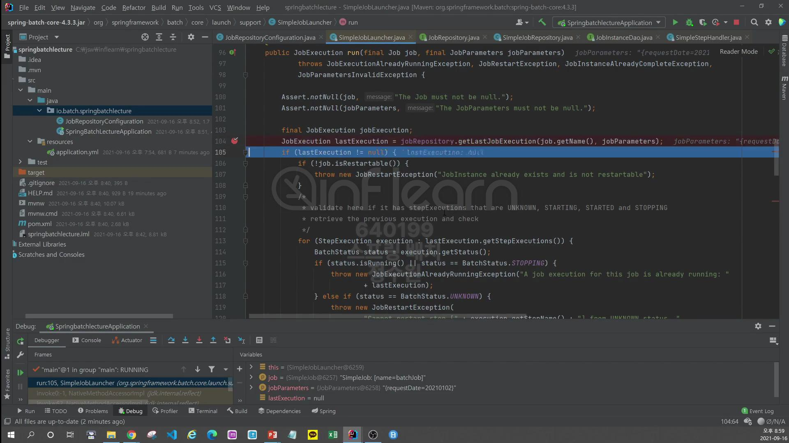
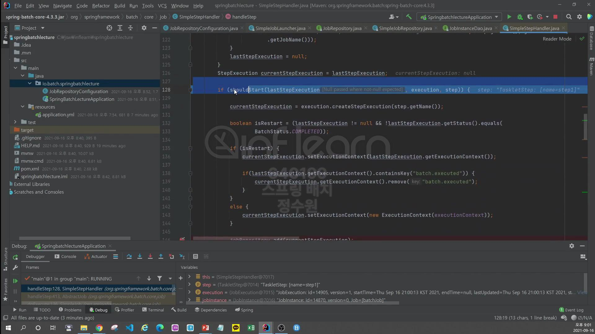

실습을 통해서 확인해보자. <br>
```java
@Configuration
@RequiredArgsConstructor
public class JobRepositoryConfiguration {
    private final JobBuilderFactory jobBuilderFactory;
    private final StepBuilderFactory stepBuilderFactory;

    @Bean
    public Job BatchJob() {
        return this.jobBuilderFactory.get("batchJob")
                .start(step1())
                .next(step2())
                .build();
    }

    @Bean
    public Step step1() {
        return this.stepBuilderFactory.get("step1")
                .tasklet((contribution, chunkContext) -> {
                    System.out.println("Executing Step 1");
                    return RepeatStatus.FINISHED;
                })
                .build();
    }

    @Bean
    public Step step2() {
        return this.stepBuilderFactory.get("step2")
                .tasklet((contribution, chunkContext) -> null)
                .build();
    }

}
```
우리가 job을 실행시키게 되면 각각의 테이블에는 각각의 job, step과 관련된 meta-data가 저장이 된다. <br>
그럼 그 데이터가 저장된 데이터를 jobRepository로 확인해보는 test를 실행해 보자. <Br>
그리고 customJobRepository를 사용해보는 테스트를 해보자 <br>

<br>


이곳이 지금 SimpleJobLauncher이다. <br>

그리고 여기엔 JobRepository가 있다. <br>

interface이다. 그리고 구현체로는 아래의 SimpleJobRepository를 사용한다.<br>

속성으로는 각각의 Dao Class들을 가지고 있다. <br>

자, 그러면 job에 마지막 실행된 execution 정보를 가지고 있고 우리가 한번도 실행을 하지 않았기 때문에 이 값은 null이다. <br>

jobParameter를 검증하고 <br>

jobExecution을 생성한다. <br>

이번엔 step이다. step도 마지막에 실행된 execution정보를 가지고 온다. <br>
그런데 이런 정보를 왜 가지고 오냐면 batch job이 실행될 때 step이 다시금 실행 될 때 실행이 될 수 있는 상황인지를 비교해서 각 step이나 job이 <br>
재시작 또는 실패 완료인지에 따라서 스프링 배치가 job을 실행할 수 있는지 없는지를 판단하기 때문이다. <br>

시작할 수 있는지를 본다. 그리고 시작이 가능하다면 <br>

새로운 Execution을 만들어서 step에 전달한다. <br>

그리고 db에 저장을 하고 

update한다. 그래서 실행이 완료된 것이고 db에 가보면 <br>

들어와 있다. 


각각의 data들이 저장이 됐다. <br>
이제 여기서 JobRepository의 interface를 보면 <br>

저 getLastJobExecution를 사용해서 마지막으로 저장된 jobExecution을 객체를 Runtime에서 가져와 보자. <br>


그런데
```java
jobRepository.getLastJobExecution(jobName, jobParameters);
```
이 코드에서 jobParamters는 db에 이미 들어있는 정보를 주어야만 그 jobParameter에 저장된 <br>
값에 해당하는 jobExecution을 가져올 수 있다 <br>
참고로 BATCH_JOB_EXECUTION_PARAMS는 <br>

부모 id가 JOB_EXECUTION_ID이다. 그래서 JOB_EXECUTION_ID에 해당하는 ID를 가져올 수 있다.<br>

그러니까 저기 보이는것처럼 JOB_EXECUTION_ID가 14905에 해당하는 <br>

JOB_PARAMETERS의 값을 가져올 수 있기 때문에 . <br>
저기 저장 된 KEY_NAME과 STRING_VAL을 JOB_EXECUTION_ID를 정확히 주어야 조회할 수 있다. <br>
```java
@Component
public class JobRepositoryListener implements JobExecutionListener {

    @Autowired
    private JobRepository jobRepository;

    @Override
    public void beforeJob(JobExecution jobExecution) {

    }

    @Override
    public void afterJob(JobExecution jobExecution) {
        String jobName = jobExecution.getJobInstance().getJobName();

        JobParameters jobParameters = new JobParametersBuilder()
                .addString("requestDate", "20210102").toJobParameters();

        JobExecution lastJobExecution = jobRepository.getLastJobExecution(jobName, jobParameters);
        if (lastJobExecution != null) {
            for (StepExecution execution : lastJobExecution.getStepExecutions()) {
                BatchStatus status = execution.getStatus();
                System.out.println("status = " + status);

                ExitStatus exitStatus = execution.getExitStatus();
                System.out.println("exitStatus = " + exitStatus);

                String stepName = execution.getStepName();
                System.out.println("stepName = " + stepName);
            }
        }
    }
}
```
```java
@Configuration
@RequiredArgsConstructor
public class JobRepositoryConfiguration {
    private final JobBuilderFactory jobBuilderFactory;
    private final StepBuilderFactory stepBuilderFactory;
    private final JobExecutionListener jobRepositoryListener;

    @Bean
    public Job BatchJob() {
        return this.jobBuilderFactory.get("batchJob")
                .start(step1())
                .next(step2())
                .listener(jobRepositoryListener)
                .build();
    }

    @Bean
    public Step step1() {
        return this.stepBuilderFactory.get("step1")
                .tasklet((contribution, chunkContext) -> {
                    System.out.println("Executing Step 1");
                    return RepeatStatus.FINISHED;
                })
                .build();
    }

    @Bean
    public Step step2() {
        return this.stepBuilderFactory.get("step2")
                .tasklet((contribution, chunkContext) -> null)
                .build();
    }

}
```

실행이 잘 되었고 <br>

db에도 저장이 잘 되었다. <br>


PARAMS 테이블을 보면 requestDate에 20210102를 확인할 수 있다. <br>

파라미터 값을 20210103으로 바꾸고 실행을 해보자. <br>

디버깅을 해보면 
    

jobName과 jobParameters를 확인해 보자. <br>

그 밑으로는 잘 가져온것을 확인하면 됨.


<br>

이번엔 jobRepository가 초기화 될 때 커스터마이징 하는 테스트를 해보자. <br>
BatchConfigure interface 또는 이 인터페이스를 구현한 클래스를 상속해서 변경할 수 있는데 이번에는 BasicBatchConfigure 클래스를 상속해서 해보자. <br>


```java
@Configuration
public class CustomBatchConfigurer extends BasicBatchConfigurer {

    private final DataSource dataSource;

    protected CustomBatchConfigurer(BatchProperties properties, DataSource dataSource, TransactionManagerCustomizers transactionManagerCustomizers) {
        super(properties, dataSource, transactionManagerCustomizers);
        this.dataSource = dataSource;
    }

    @Override
    protected JobRepository createJobRepository() throws Exception {
        JobRepositoryFactoryBean factory = new JobRepositoryFactoryBean();

        factory.setDataSource(dataSource);
        factory.setTransactionManager(getTransactionManager());
        factory.setIsolationLevelForCreate("ISOLATION_READ_COMMITTED");
        factory.setTablePrefix("SYSTEM_");
        
        return factory.getObject();
    }
}
```
이렇게 하고 실행을 해보자. <br>


실행을 했는데 오류가 난다. springbatch.SYSTEM_JOB_INSTANCE가 없다는 의미.
이건 테이블 명이 안맞는것. 그래서 이걸 실행하려면 테이블 명도 바꿔 주어야 한다. <br>


