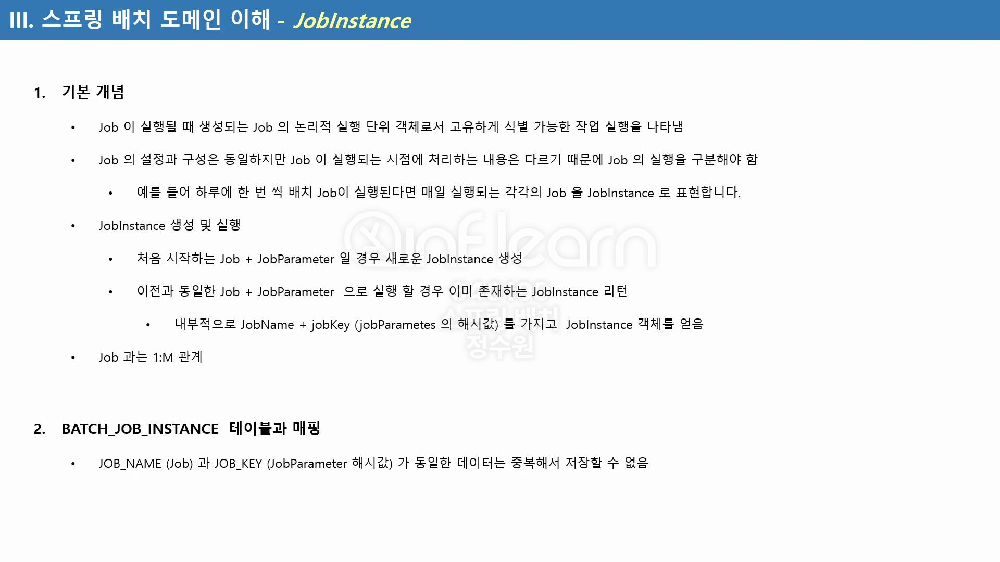
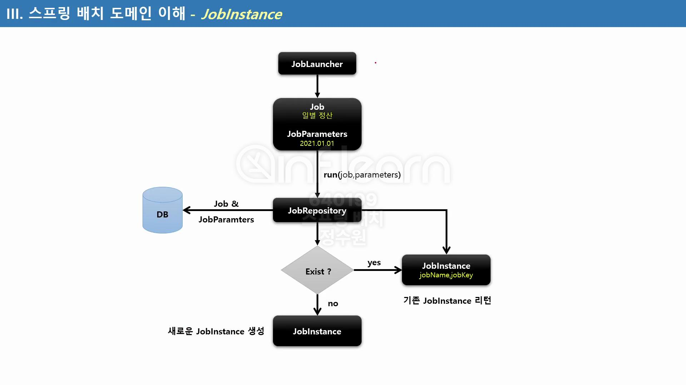
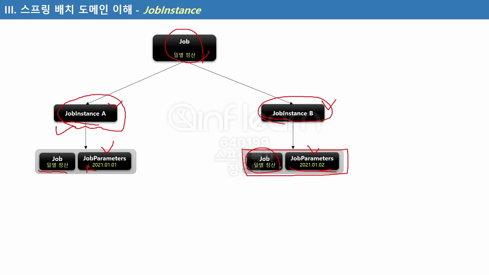
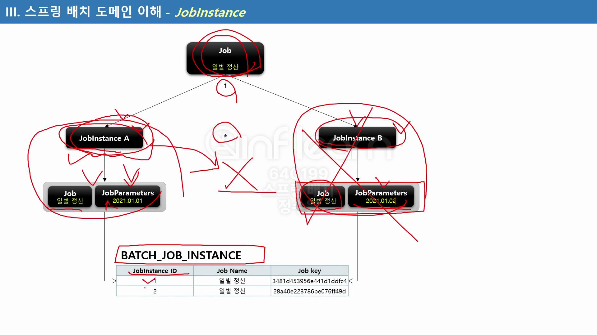
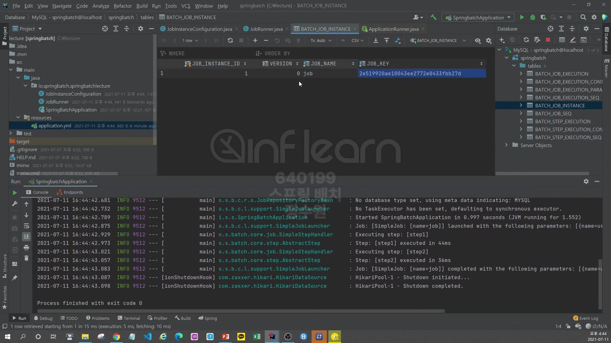
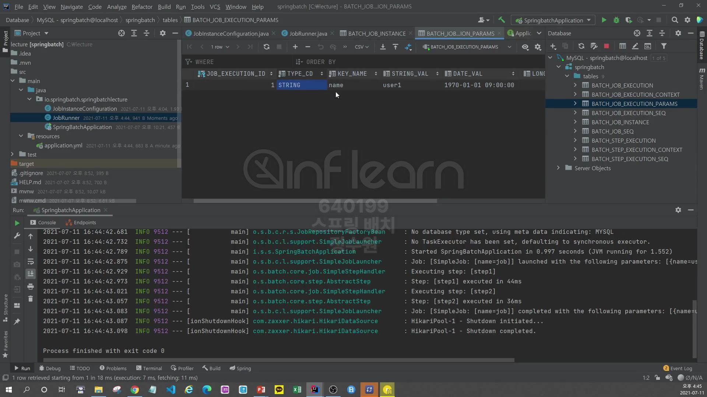
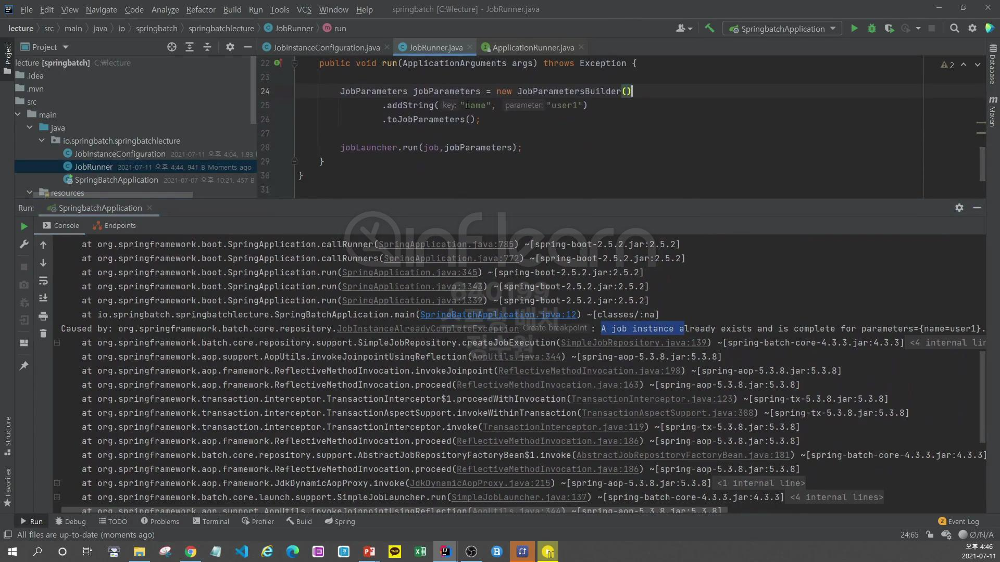
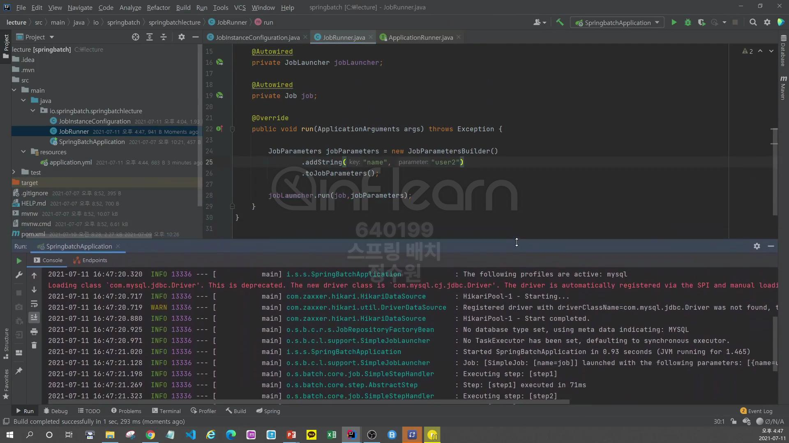

JobRepository는 job의 실행중에 발생하는 meta data들을 저장하는 repository이다. <br>

만약 2021.01.01으로 Parameter를 준다면 새로운 인스턴스가 생성되지 않고 JobInstace A가 반환이 되어서 실행이 되게 되는데 Spring Batch는 똑같은 <br>
이름읠 job이 실행됐기 때문에 중단이 된다. <br>

테스트를 수행해보자. <br>
```yml
  batch:
    job:
      enabled: false
```
직접만든 JobRunner를 활용하기 위해 SpringBoot가 자동으로 실행시키는 jobRunner를 비활성화 시킨다. <br>
```java
@Component
public class JobRunner implements ApplicationRunner {

    @Autowired
    private JobLauncher jobLauncher;
    @Autowired
    private Job job;

    @Override
    public void run(ApplicationArguments args) throws Exception {
        JobParameters jobParameters = new JobParametersBuilder()
                .addString("name", "user1")
                .toJobParameters();

        jobLauncher.run(job, jobParameters);
    }
}
```
```java
@Configuration
@RequiredArgsConstructor
public class JobInstanceConfiguration {
    private final JobBuilderFactory jobBuilderFactory;
    private final StepBuilderFactory stepBuilderFactory;

    @Bean
    public Job job() {
        return jobBuilderFactory.get("job")
                .start(step1())
                .next(step2())
                .build();
    }

    @Bean
    public Step step1() {
        return stepBuilderFactory.get("step1")
                .tasklet((stepContribution, chunkContext) -> {
                    return RepeatStatus.FINISHED;
                }).build();
    }

    @Bean
    public Step step2() {
        return stepBuilderFactory.get("step2")
                .tasklet((stepContribution, chunkContext) -> {
                    return RepeatStatus.FINISHED;
                }).build();
    }
}
```

정상적으로 실행된것을 확인할 수 있다.

파라미터도 확인할 수 있다. <br>
한번 더 파라미터 값을 똑같이 주고 실행을 하게 되면! <br>

이렇게 예외가 발생한다. A job instance already exists with the same parameters. <br>
가 뜬다.  

parameter를 다르게 주고 실행을 하게 되면 정상적으로 실행이 된다.<br>