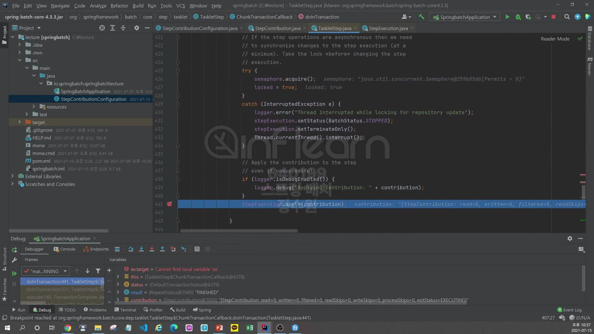

```java
@Configuration
@RequiredArgsConstructor
public class StepContributionConfiguration {
    private final JobBuilderFactory jobBuilderFactory;
    private final StepBuilderFactory stepBuilderFactory;

    @Bean
    public Job BatchJob() {
        return this.jobBuilderFactory.get("Job")
                .start(step1())
                .next(step2())
                .build();
    }

    @Bean
    public Step step1() {
        return stepBuilderFactory.get("step1")
                .tasklet((contribution, chunkContext) -> {
                    System.out.println(">> step has executed");
                    return RepeatStatus.FINISHED;
                })
                .build();
    }

    @Bean
    public Step step2() {
        return stepBuilderFactory.get("step2")
                .tasklet((contribution, chunkContext) -> {
                    System.out.println(">> step has executed");
                    return RepeatStatus.FINISHED;
                })
                .build();
    }

}
```
여기서 이제 확인할 것은 StepContributiond이 생성되는 시점과 그 시점의 내용을 찾아보자. 

근데 아직은 Chunk를 학습하지 않았기 때문에 readCount, writeCount, filterCount, commitCount, rollbackCount등의 값들은 <br>
학습하지 않는다. 그리고 이건 0으로 초기화 돼 있다.

여기서부터 시작해보자. 그 이전의 job이 실행되고 job의 단계들은 생략! <br>
TaskStep은 <br> 

stepExecution.createStepContribution()을 통해 StepContribution이 생성된다. <br>

생성 시점은 Tasklet이 수행되는 과정 중에 있다. 그리고 doInTransaction() 즉, Chunk기반의 프로세스를 처리하는 그 시점.<br>
그리고 실제 database에 commit하기 직전에 이 과정이 끝난다. 왜냐? database는 실제 stepExecution의 내용이 저장 돼야 하는데 그 저장되기 전에 <br>
stepContribution이 가지고 있는 최종적인 데이터를 stepExecution에 적용해야하기 때문에 commit 직전에 이런 과정을 하는 것이다.<br>

그래서 생성하고 tasklet을 실행시킨다. <br>

속성들을 확인하면 <br>

값들이 default로 0인것을 확인할 수 있다. <br>

확인해보면 result = tasklet.execute(contribution, chunkContext);
finally에서 stepExcution.apply(contribution); 이 부분이 있다. <br>

이 부분은 contribution에 있는 속성들을 execution에 있는 속성들에 update하고 있는 것이다.

그리고 이제 step2도 실행한다.
```java
@Configuration
@RequiredArgsConstructor
public class StepContributionConfiguration {
    private final JobBuilderFactory jobBuilderFactory;
    private final StepBuilderFactory stepBuilderFactory;

    @Bean
    public Job BatchJob() {
        return this.jobBuilderFactory.get("Job")
                .start(step1())
                .next(step2())
                .build();
    }

    @Bean
    public Step step1() {
        return stepBuilderFactory.get("step1")
                .tasklet((contribution, chunkContext) -> {
                    String jobName = contribution.getStepExecution().getJobExecution().getJobInstance().getJobName();
                    
                    System.out.println(">> step has executed");
                    return RepeatStatus.FINISHED;
                })
                .build();
    }

    @Bean
    public Step step2() {
        return stepBuilderFactory.get("step2")
                .tasklet((contribution, chunkContext) -> {
                    System.out.println(">> step has executed");
                    return RepeatStatus.FINISHED;
                })
                .build();
    }

}
```
이렇게 객체 내부의 값을 참고해서 활용할 수도 있다. <br>


