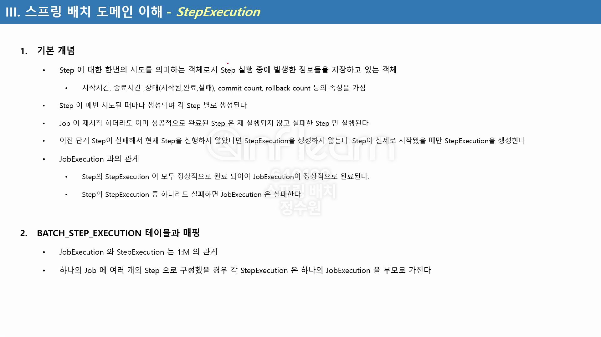
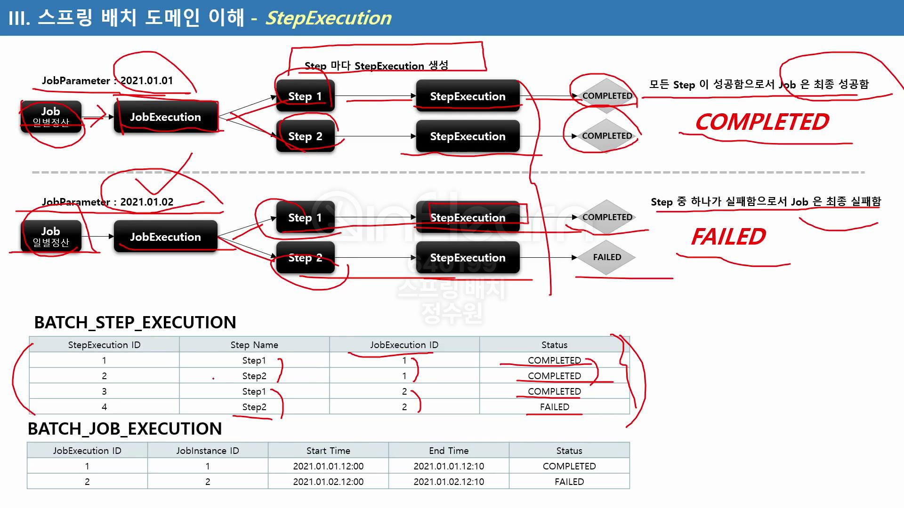
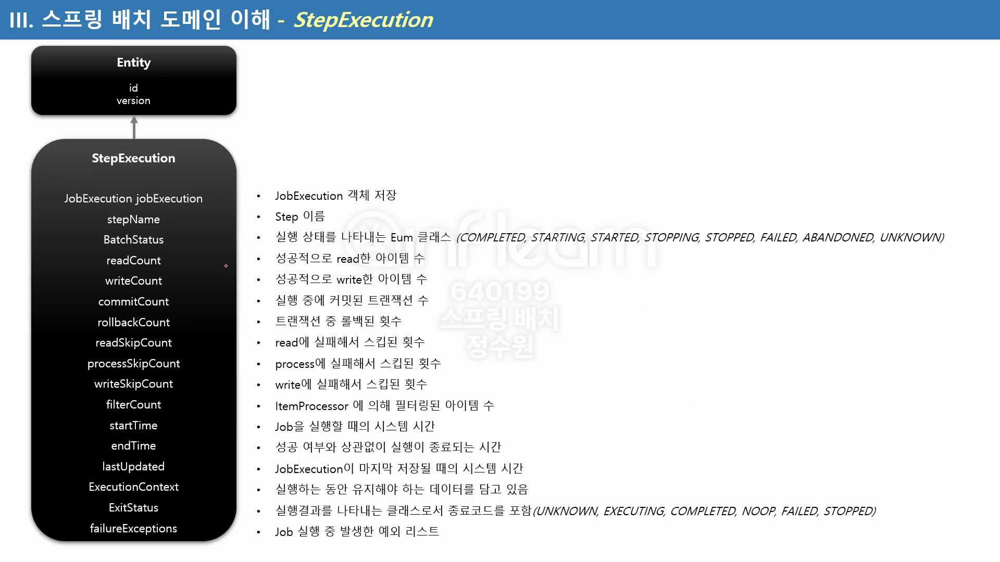
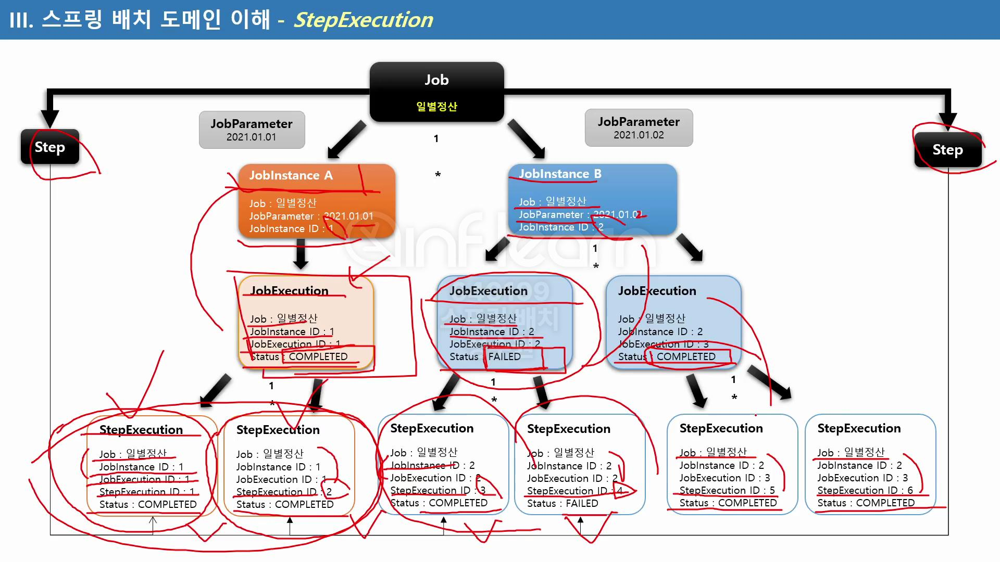
```java
@Configuration
@RequiredArgsConstructor
public class StepExecutionConfiguration {

    private final JobBuilderFactory jobBuilderFactory;
    private final StepBuilderFactory stepBuilderFactory;

    @Bean
    public Job BatchJob() {
        return this.jobBuilderFactory.get("job")
                .start(step1())
                .next(step2())
                .next(step3())
                .build();
    }

    public Step step1() {
        return stepBuilderFactory.get("step1")
                .tasklet((contribution, chunkContext) -> {
                    System.out.println(">> step1 has executed");
                    return RepeatStatus.FINISHED;
                })
                .build();
    }

    public Step step2() {
        return stepBuilderFactory.get("step2")
                .tasklet((contribution, chunkContext) -> {
                    System.out.println(">> step2 has executed");
                    return RepeatStatus.FINISHED;
                })
                .build();

    }

    public Step step3() {
        return stepBuilderFactory.get("step3")
                .tasklet((contribution, chunkContext) -> {
                    System.out.println(">> step3 has executed");
                    return RepeatStatus.FINISHED;
                })
                .build();

    }
}
```
실행을 시켜보자 <br>
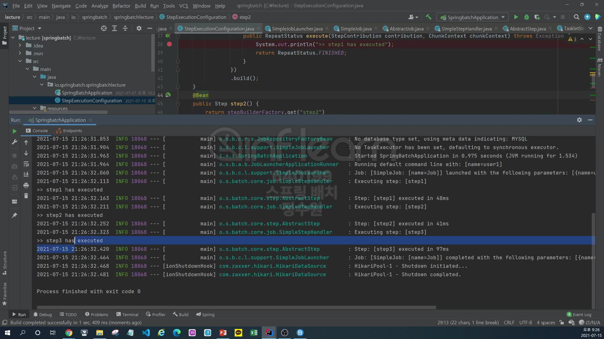
잘 동작을 했다. 
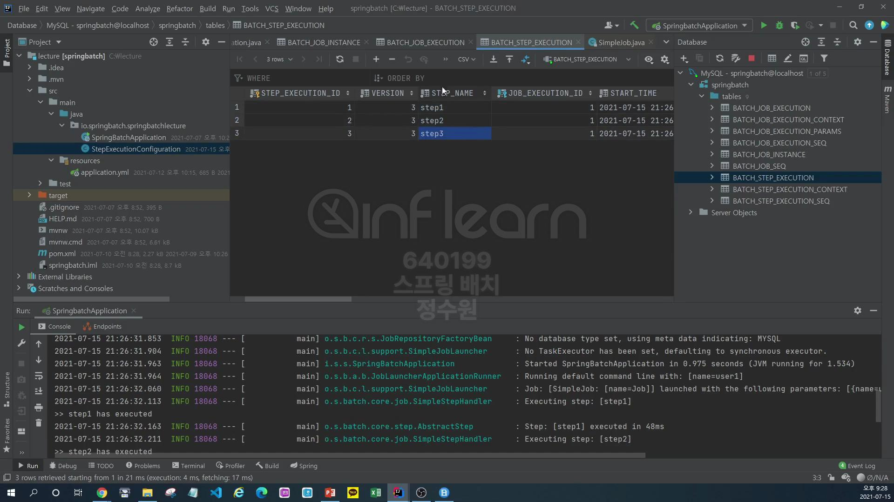
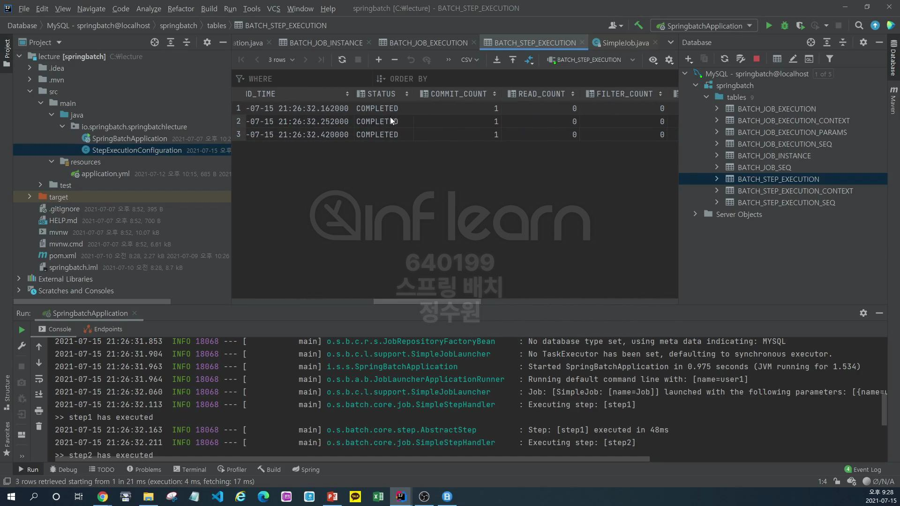
STATUS는 COMPLETED이다. <br>
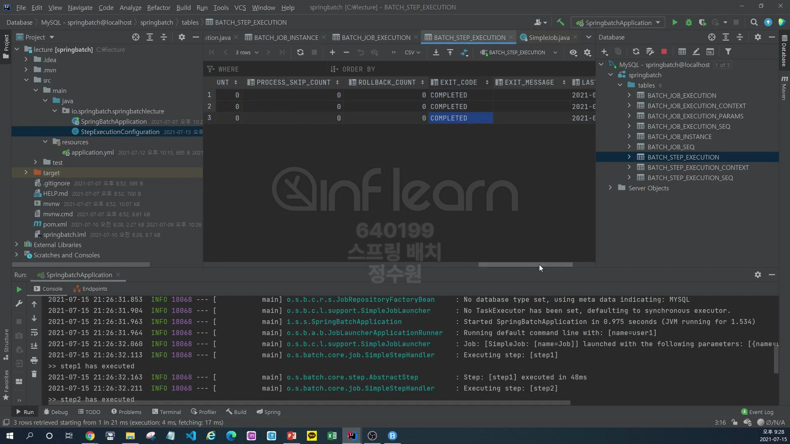
EXIT_CODE도 COMPLETED이다. <br>
데이터를 삭제하고 이번엔 step2에 예외를 발생시켜보자. <br>
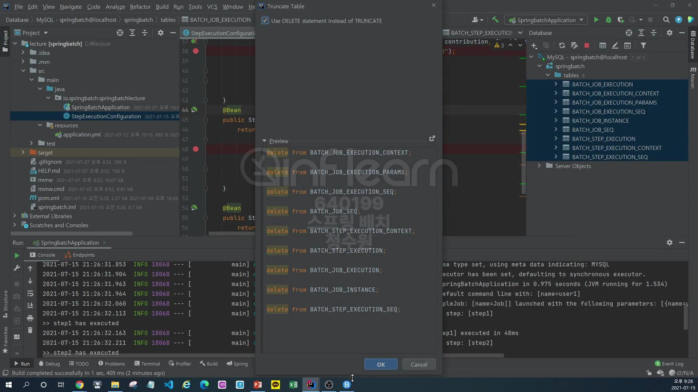

```java
@Configuration
@RequiredArgsConstructor
public class StepExecutionConfiguration {

    private final JobBuilderFactory jobBuilderFactory;
    private final StepBuilderFactory stepBuilderFactory;

    @Bean
    public Job BatchJob() {
        return this.jobBuilderFactory.get("job")
                .start(step1())
                .next(step2())
                .next(step3())
                .build();
    }

    public Step step1() {
        return stepBuilderFactory.get("step1")
                .tasklet((contribution, chunkContext) -> {
                    System.out.println(">> step1 has executed");
                    return RepeatStatus.FINISHED;
                })
                .build();
    }

    public Step step2() {
        return stepBuilderFactory.get("step2")
                .tasklet((contribution, chunkContext) -> {
                    System.out.println(">> step2 has executed");
                    throw new RuntimeException("step2 has failed");
                })
                .build();

    }

    public Step step3() {
        return stepBuilderFactory.get("step3")
                .tasklet((contribution, chunkContext) -> {
                    System.out.println(">> step3 has executed");
                    return RepeatStatus.FINISHED;
                })
                .build();

    }
}
```
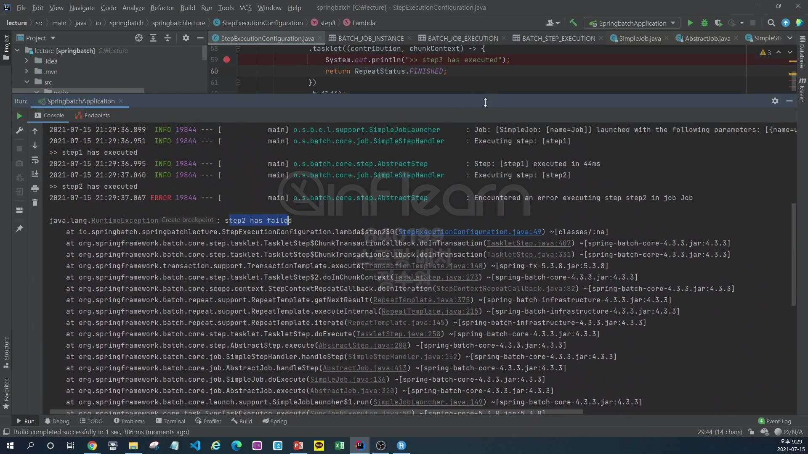
2번째 step에서 예외가 발생했다. <br>
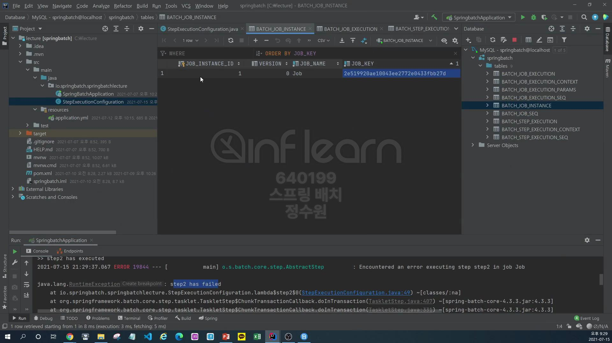
JOB_INSTANCE는 동일하게 하나 생성
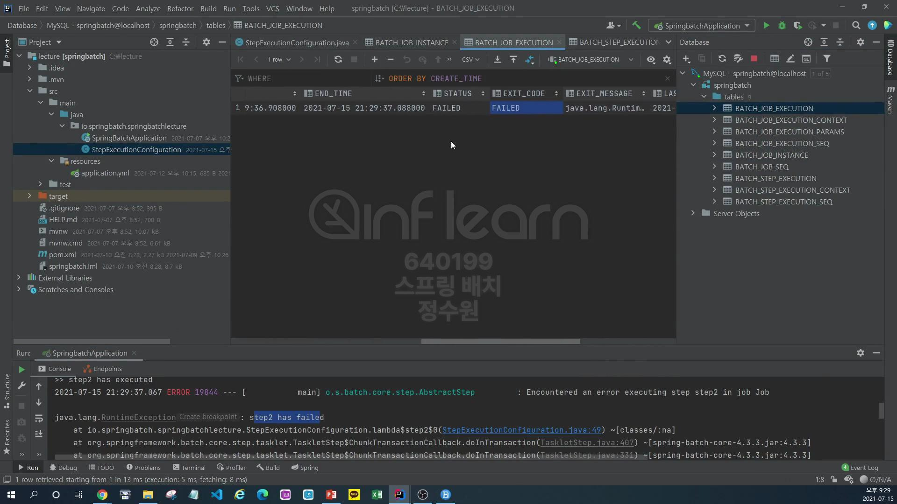
JOB_EXECUTION의 STATUS와 EXIT_CODE는 FAILED이다. <br>
3개의 step중 한개가 failed했기 때문에 <br>
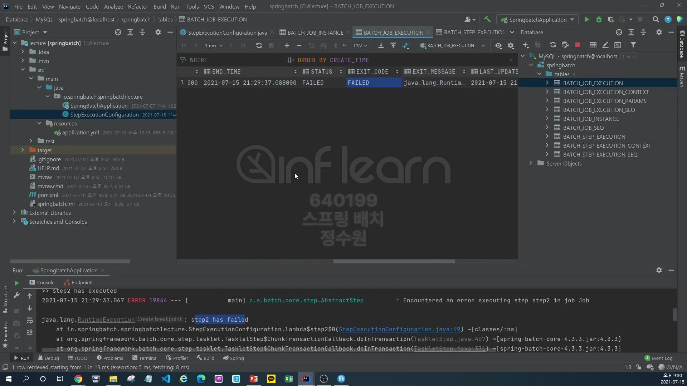  
JOB_EXECUTION의 상태는 FAILED이다. <br>
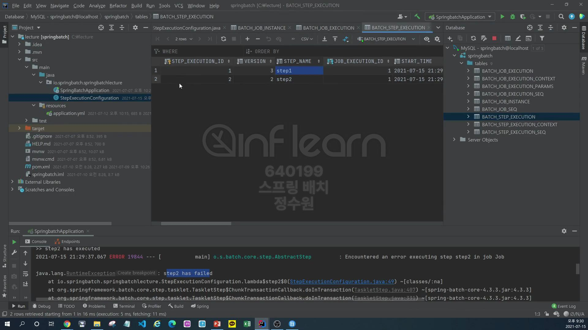
STEP_EXECUTION에서도 step2가 생성은 되었다. 
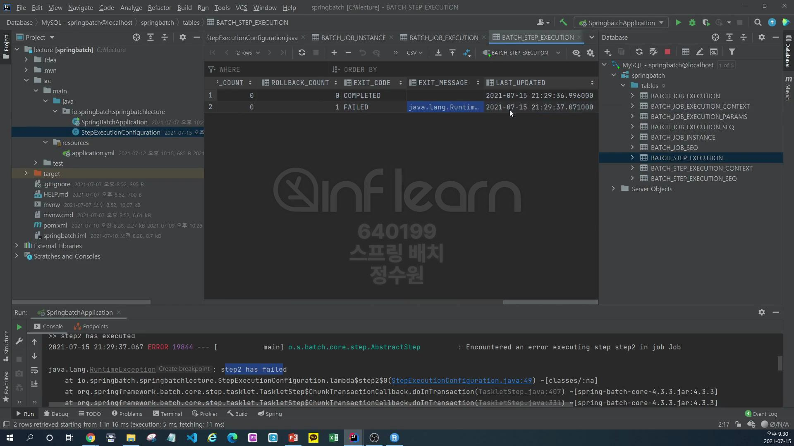
이 때 step3는 실행되지도 않았다. 이 상태에서 다시 실행을 시키면 실패기 때문에 job이 재시작이 가능한다. <br>
```java
@Configuration
@RequiredArgsConstructor
public class StepExecutionConfiguration {

    private final JobBuilderFactory jobBuilderFactory;
    private final StepBuilderFactory stepBuilderFactory;

    @Bean
    public Job BatchJob() {
        return this.jobBuilderFactory.get("job")
                .start(step1())
                .next(step2())
                .next(step3())
                .build();
    }

    public Step step1() {
        return stepBuilderFactory.get("step1")
                .tasklet((contribution, chunkContext) -> {
                    System.out.println(">> step1 has executed");
                    return RepeatStatus.FINISHED;
                })
                .build();
    }

    public Step step2() {
        return stepBuilderFactory.get("step2")
                .tasklet((contribution, chunkContext) -> {
                    System.out.println(">> step2 has executed");
                    return RepeatStatus.FINISHED;
                })
                .build();

    }

    public Step step3() {
        return stepBuilderFactory.get("step3")
                .tasklet((contribution, chunkContext) -> {
                    System.out.println(">> step3 has executed");
                    return RepeatStatus.FINISHED;
                })
                .build();

    }
}

```
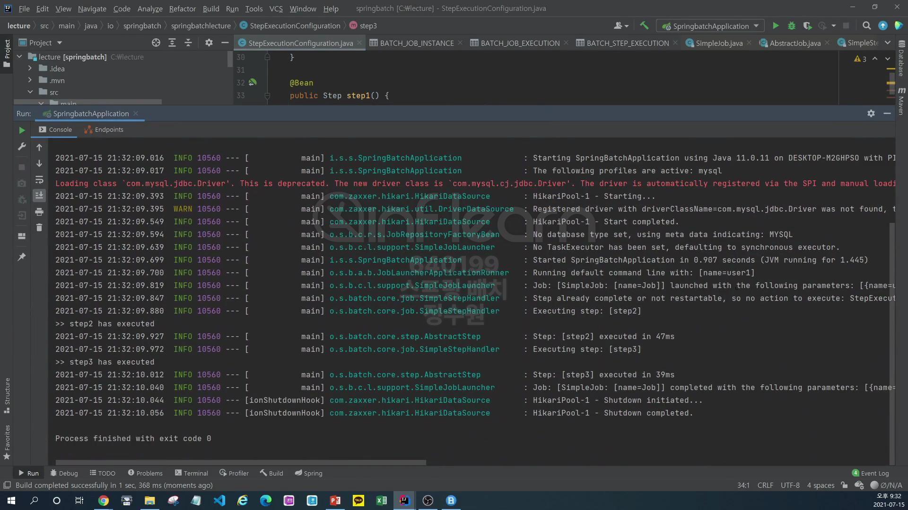
예외가 발생하지 않고 모든 스탭이 성공했다. <br>
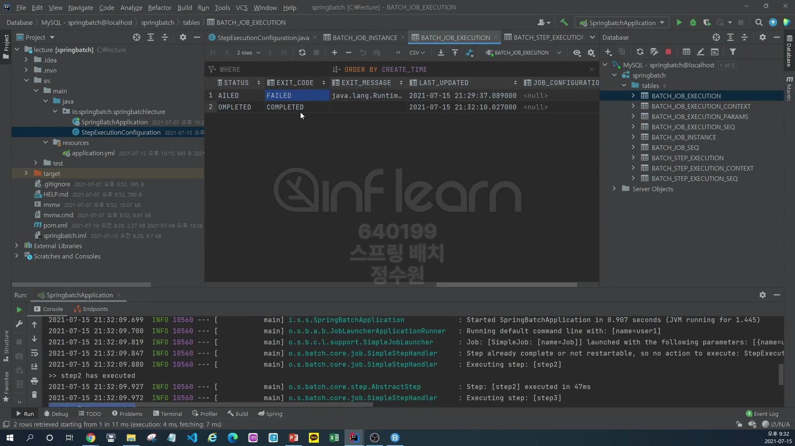
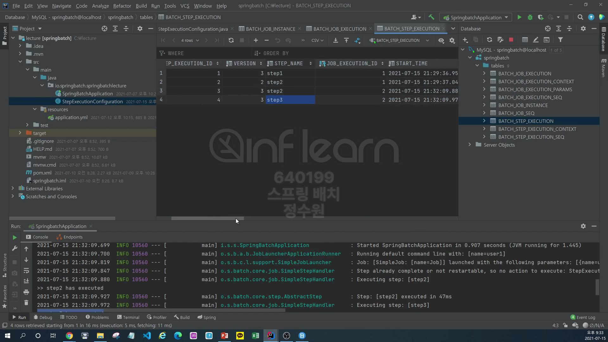
2번째에서는 step2, step3가 실행되고, 상태가 COMPLETED로 변경되었다. <br> 
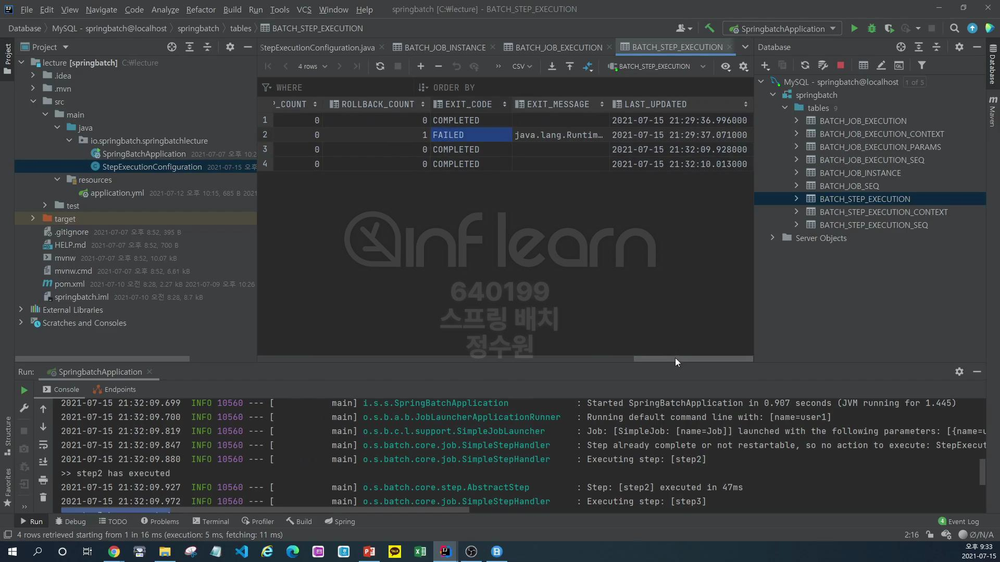


