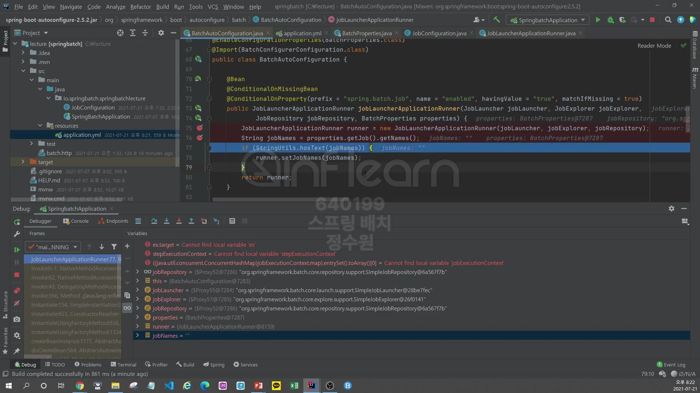
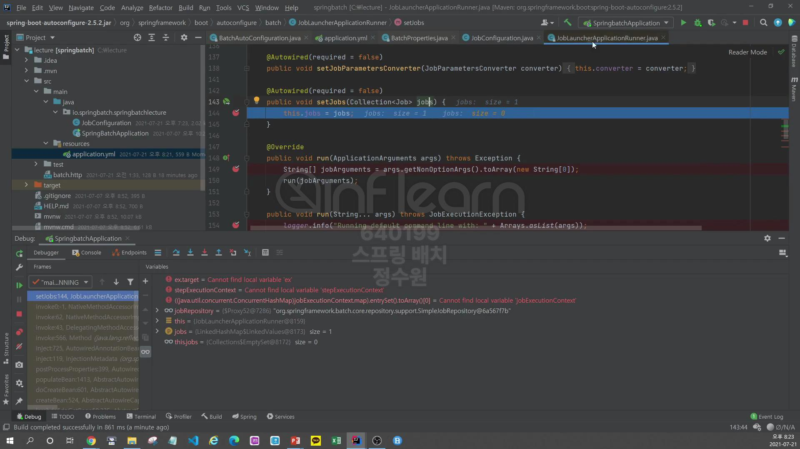
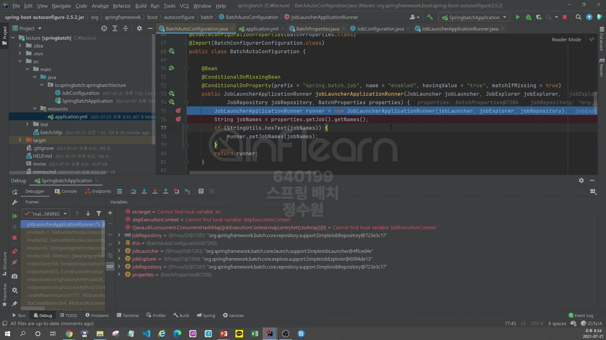

```java
@Configuration
@RequiredArgsConstructor
public class JobConfiguration {
    private final JobBuilderFactory jobBuilderFactory;
    private final StepBuilderFactory stepBuilderFactory;

    @Bean
    public Job BatchJob() {
        return this.jobBuilderFactory.get("Job")
                .start(step1())
                .next(step2())
                .build();
    }

    @Bean
    public Step step1() {
        return stepBuilderFactory.get("step1")
                .tasklet((contribution, chunkContext) -> {
                    System.out.println("step1 has executed");
                    return RepeatStatus.FINISHED;
                })
                .build();
    }

    @Bean
    public Step step2() {
        return stepBuilderFactory.get("step2")
                .tasklet((contribution, chunkContext) -> {
                    System.out.println("step2 has executed");
                    return RepeatStatus.FINISHED;
                })
                .build();
    }
}
```
실행을 시키면서 확인해보자. <br>


그럼 먼저 여기로 온다. <br>
여기서 BatchAutoConfiguration에서 JobLauncherApplicationRunner를 생성한다. <br>
그런데 여기서 BatchProperties를 DI 받고 있는데 이 속성들 안에서 getNames() 값들을 가져온다. <br>

근데 이 값들이 빈 값이다 그 이유는 우리가 설정을 안했기 때문이다. <br>

그래서 if 구문에 해당이 되지 않고 생성이 완료된다. <br>

그리고 JobLauncherApplicationRunner에 setJobs를 호출하는데 이 method는 우리가 직접 하는것은 아니고 Spring Boot가 자동으로 호출한다. <br>
이때 jobs로 들어오는것이 우리가 만든 job들이다. <br>
그래서 이 JobLauncherApplicationRunner는 여러개의 job을 가지고 있는것이다. 그래서 기본적으로는 jobs에 포함된 모든 값을 순서대로 호출하면서<br>
실행을 시키는 것이다. <br>

그리고 run을 하게 된다. <br>
이건 아래와 같이 <br>

ApplicationRunner를 구현한 것이기 때문에 run 메서드가 호출된다. <br>

그래서 이 args에는 실행 시킬 때 지정한 name=user1과 같은 값이 들어온다. <br>

결국은 args를 jobParameters에 담는다. <br>

저장이 됨. <br>
자, 그리고 job을 실행시킨다. <br>

지금 이 job은 <br>

우리가 설정한 job이다. <br>

그리고 for문을 돌리는데 보면 아까 <br>

jobNames가 빈 값이라서 

여기도 빈값이가 그렇기 때문에 이게 빈 값이 아닌 경우는 아래 구문을 실행하고 근데 지금은 기게 빈 값이기 때문에 <br>

바로 execute를 실행시킨다. <br>
근데 만약 저 구문을 수행시키려면 JobNames가 빈 값이 들어오면 안된다. <br>
그렇다면 어떻게 해야할까? 그거 application.yml에 설정을 해주면 된다. <br>
일단은 execute가 되서 실행이 된다. 우선 아래로 옴. <br>

여기서 실행이 되서 batch job이 실행 됨. <br>
<br>
<br>
<br>
BatchProperties에 보면 Job과 Jdbc가 있고 prefix로 spring.batch가 설정 돼 있다. <br>
Job을 보면 

getNames()가 있는데 이게 바로 아까 getJobNames()에서 가져가는 속성이다. <br>
그리고 Jdbc는 <br>

tablePrefix와 scheme가 있다. <br>
이 두개는 앞선 강의에서 살펴봤다. <br>
이건 저번엔 application.yml에서 설정을 안하고 코드로 설정을 했었는데 이것도 application.yml 설정을 할 수 있다. <br>
```yml
spring:
  config:
    activate:
      on-profile: mysql
  datasource:
    hikari:
      jdbc-url: jdbc:mysql://localhost:3306/springbatch?useUnicode=true&characterEncoding=utf8
      username: root
      password:
      driver-class-name: com.mysql.jdbc.Driver
  batch:
    job:
      names: batchJob2 
```
names는 여러개의 job을 실행시키거나 어떤 특정 job을 실행시키고자 할 때 설정하는 값이다. <br>
그래서 만약 batchJob2로 설정해주면 
```java
@Configuration
@RequiredArgsConstructor
public class JobConfiguration {
    private final JobBuilderFactory jobBuilderFactory;
    private final StepBuilderFactory stepBuilderFactory;

    @Bean
    public Job BatchJob() {
        return this.jobBuilderFactory.get("batchJob1")
                .start(step1())
                .next(step2())
                .build();
    }

    @Bean
    public Step step1() {
        return stepBuilderFactory.get("step1")
                .tasklet((contribution, chunkContext) -> {
                    System.out.println("step1 has executed");
                    return RepeatStatus.FINISHED;
                })
                .build();
    }

    @Bean
    public Step step2() {
        return stepBuilderFactory.get("step2")
                .tasklet((contribution, chunkContext) -> {
                    System.out.println("step2 has executed");
                    return RepeatStatus.FINISHED;
                })
                .build();
    }
}

```
이렇게 나는 batchJob1을 설정해 두었기 때문에 아무것도 실행이 되지 않는다. <br>

실행해 보면 batch가 실행이 안된다. <br>

수정 후에 실행을 시키게 되면 <br>

batch가 실행이 된다. <br>
그런데 보통 이렇게 hard-coding하지 않고 실행 시점에 선택해서 실행해야 하기 때문에 <br>

```java
${job.name:NONE}
```
이렇게 설정한다. <br>

이렇게 실행시키면 job.name에 batchjob1dl binding되게 된다. <br>
근데 만약 아무런 값도 넣지 않고 실행하면 NONE이라는 이름으로 실행을 하고 그럼 NONE으로 등록된 batch가 없기 때문에 아무런 batch도 실행되지 않는다. <br>
debug로 한번 확인해보자 <br>



batchJob1이 설정되 있다. <br>


이제 여기 안으로 들어와서 split해서 job을 나누기 때문에 <br>

이렇게 ,로 구분하면 여러개의 job을 동시에 실행시킬 수 있다. <br>

jobToRun에는 하나만 넣어줘서 하나만 들어가 있음
simpleMatch는 우리가 설정한 jobName과 일치하는지 확인하는 것이다. <br>


 


 


